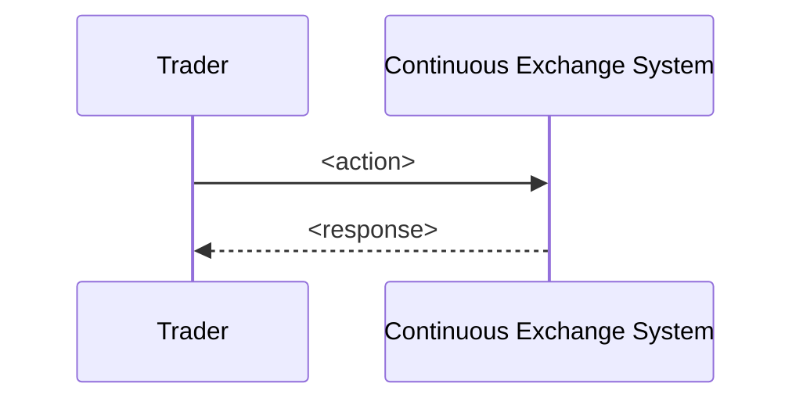
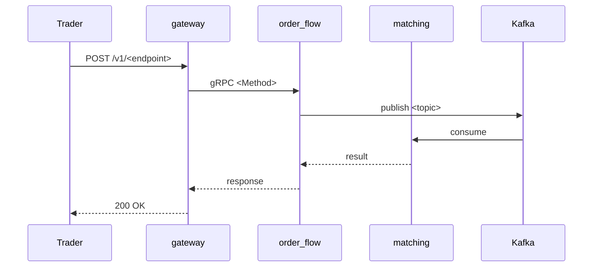

# Skill: create-feature

## Purpose

Bootstrap a new feature F-XX with the canonical 6-file structure that the project enforces (see [CLAUDE.md §26a](../../../CLAUDE.md) — Sequence diagram placement rules).

After this skill runs, all artifacts needed by the **docs-first / no-code-before-docs** rule are in place, so the next step can be either `proto-contract-designer`, `data-schema-designer`, or `implementation-planner`.

## When to use

- "Создай новую фичу F-XX-..."
- "Сделай skeleton для F-XX"
- "Начни F-XX по нашему шаблону"
- "Scaffold F-XX"

## Required inputs

- **Feature ID** (`F-XX` — двузначное число, проверить что не занято в `docs/02-system/features/`)
- **Short name** (kebab-case, e.g. `post-trade-report`)
- **Lifecycle stage** — runtime / post-trade / setup / analytics / operations
- **Brief business goal** (одно предложение)

## Step-by-step

1. **Проверить ID не занят**:
   ```bash
   ls docs/02-system/features/ | grep "F-XX-"
   ```
   Если занят — спросить пользователя другой.

2. **Создать директорию фичи**:
   ```
   docs/02-system/features/F-XX-<short-name>/
   ├── feature.yaml
   └── README.md
   ```

3. **Заполнить `feature.yaml`** по шаблону (см. ниже).

4. **Создать use case**:
   ```
   docs/02-system/use-cases/UC-FXX-01-<short-name>/
   ├── use-case.md
   └── sequences/
       └── SEQ-UC-FXX-01-system.md
   ```
   Это **system-level** sequence (внешний участник ↔ Continuous Exchange System как black box).

5. **Создать service-level sequence**:
   ```
   docs/05-components/sequences/SEQ-F-XX-UC-FXX-01-services.md
   ```
   Это **service-level** (cross-component: gateway → order_flow → matching → ...).

6. **Добавить stub в traceability**:
   - `docs/traceability/feature-traceability.md` — добавить строку для F-XX

7. **Сообщить пользователю** что создано + next agent (proto-contract-designer или data-schema-designer).

## Шаблон feature.yaml

```yaml
feature:
  id: F-XX
  name: <Полное название>
  status: planned
  owner: core-team

description: >
  <2-3 предложения о бизнес-цели и user value>

lifecycleStage: runtime  # runtime | post-trade | setup | analytics | operations

primaryComponents:
  - gateway
  - order-flow
  # добавить релевантные

protoContracts:
  - contracts/proto/fob/<package>/v1/<file>.proto  # будут созданы proto-contract-designer

codePaths: []  # заполняется implementation-planner

kafkaTopics:
  produces: []
  consumes: []

postgresTables:
  reads: []
  writes: []

grpcServices:
  exposes: []
  calls: []

acceptanceCriteria:
  - "<criterion 1>"
  - "<criterion 2>"

knownIssues: []

tests:
  unit: []
  integration: []
  contract: []
```

## Шаблон README.md

```markdown
# F-XX — <Название>

> **Статус:** planned. Документация в работе, код ещё не реализован.

## Описание

<2-3 параграфа о бизнес-цели, как фича используется, что она даёт>

## Ключевые сущности

- **<Entity1>** — <описание>
- **<Entity2>** — <описание>

## Acceptance Criteria

См. [feature.yaml](feature.yaml).

## Related

- Use Case: [UC-FXX-01-<short-name>](../../use-cases/UC-FXX-01-<short-name>/use-case.md)
- System sequence: [SEQ-UC-FXX-01-system](../../use-cases/UC-FXX-01-<short-name>/sequences/SEQ-UC-FXX-01-system.md)
- Service sequence: [SEQ-F-XX-UC-FXX-01-services](../../../05-components/sequences/SEQ-F-XX-UC-FXX-01-services.md)
```

## Шаблон use-case.md

```markdown
# UC-FXX-01 — <Название use case>

## Связь с фичей
- Feature: [F-XX](../../features/F-XX-<short-name>/feature.yaml)

## Actors
- Primary: <Trader / Market-Maker / Operator / Risk Officer>
- Secondary: <External venue / Risk service / Ledger>

## Preconditions
- <условие 1>
- <условие 2>

## Main Flow
1. <Actor> делает X
2. Система валидирует Y
3. ...
N. Система отвечает Z

## Alternative Flow A: <название>
...

## Negative Flow: <название>
...

## Postconditions
- <состояние 1>
- <состояние 2>

## Diagrams
- System sequence: [SEQ-UC-FXX-01-system](sequences/SEQ-UC-FXX-01-system.md)
- Service sequence: [SEQ-F-XX-UC-FXX-01-services](../../../05-components/sequences/SEQ-F-XX-UC-FXX-01-services.md)
```

## Шаблон SEQ-UC-FXX-01-system.md

```markdown
# SEQ-UC-FXX-01 — System Sequence (TODO: rewrite)

## Связь
- Feature: [F-XX](../../../features/F-XX-<short-name>/feature.yaml)
- Use case: [UC-FXX-01](../use-case.md)

## Диаграмма



## Описание шагов
1. ...
```

## Шаблон SEQ-F-XX-UC-FXX-01-services.md

```markdown
# SEQ-F-XX-UC-FXX-01 — Service Sequence (TODO: rewrite)

## Связь
- Feature: [F-XX](../../02-system/features/F-XX-<short-name>/feature.yaml)
- Use case: [UC-FXX-01](../../02-system/use-cases/UC-FXX-01-<short-name>/use-case.md)

## Диаграмма



## Стрелки и контракты

| От | К | Транспорт | Контракт |
|---|---|---|---|
| Gateway | OF | gRPC | [fob.<package>.v1.<Service>.<Method>](../../06-api/grpc/...) |
| OF | Kafka | event | [<topic>](../../06-api/messaging/<topic>.md) |
| Kafka | M | event | (same) |

## Данные

| Сущность | Хранилище | Operation |
|---|---|---|
| <Entity> | PostgreSQL `<table>` | INSERT after risk accept |
```

## Rules

- Не создавать proto, SQL, или код — это работа других агентов / skills.
- Создавать только если F-XX ID свободен.
- Использовать **Mermaid sequenceDiagram** — не graph/flowchart.
- System-level sequence только в `02-system/use-cases/{UC-ID}/sequences/`.
- Service-level sequence только в `05-components/sequences/`.

## Output

After running:
- 6 файлов созданы
- Statys в feature.yaml = `planned`
- В чат вернуть:
  - Список созданных путей
  - Рекомендованного следующего агента
  - Команды для запуска quality gate:
    ```bash
    python3 tools/proto-contract-auditor/check_proto_map.py
    python3 tools/traceability-checker/check.py
    ```
