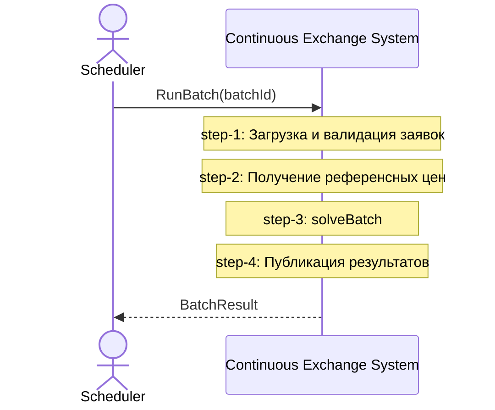

# Functional Hierarchy & Decomposition Levels

> **Source**: адаптация IN-013 (`docs-methodology-guide.md`,
> [архив](../../incoming-docs/2026-06-11-docs-methodology-guide-v1.md))
> к существующей 11-папочной структуре проекта `cont_exchange_v2.0`.
> Каркас НЕ меняется — добавляется ортогональная **ось уровней
> декомпозиции** поверх существующих папок.

## 0. Назначение

Дать единый ответ на вопрос «на каком уровне детализации описан
артефакт?» для любого документа в `docs/`. До IN-013 у проекта была
только **ось этапов** (folders `01-business`..`11-operations`).
Этого недостаточно — `domain`, `api`, `data` существуют **на каждом
уровне** (вся система vs отдельный компонент).

IN-013 вводит **вторую ось — уровни декомпозиции (Cockburn)**:
**L0 (Kite) / L1 (Sea) / L2 (Fish)**. Этот guide показывает как они
маппятся на существующие пути проекта.

## 1. Две независимые оси документации

```text
                  ┌────────────────────────────────────────────────┐
                  │  Ось 1 — Этапы жизненного цикла (СУЩЕСТВУЕТ)   │
                  │                                                 │
                  │  01-business → 02-system → 03-architecture →   │
                  │  04-domain → 05-components → 06-api → 07-data → │
                  │  08-infrastructure → 09-implementation →        │
                  │  10-testing → 11-operations                     │
                  └────────────────────────────────────────────────┘
                                       ×
                  ┌────────────────────────────────────────────────┐
                  │  Ось 2 — Уровни декомпозиции (НОВОЕ, IN-013)   │
                  │                                                 │
                  │  L0 (Kite ☁️)  — система как чёрный ящик       │
                  │  L1 (Sea  🌊)  — компоненты внутри системы     │
                  │  L2 (Fish 🐟)  — модули внутри компонента      │
                  └────────────────────────────────────────────────┘
```

Каждый артефакт имеет **позицию по обеим осям**: например, sequence
диаграмма «UC-F04-01 service-level» — этап `05-components`, уровень `L1`.

## 2. Уровни декомпозиции (Cockburn)

Базируется на «Writing Effective Use Cases» (Alistair Cockburn, 2001).

### L0 — Feature (Kite ☁️)

**Что это:** крупная бизнес-функциональность, охватывает несколько use
cases и сессий пользователя. Отвечает на «ЧТО делает система» с точки
зрения бизнеса.

**Примеры в проекте:** F-04 Batch Clearing, F-09 Batch Combo Orders,
F-12 Execution Hedge.

**Тест:** если на «как это работает?» можно дать несколько разных
сценариев — это L0; раскрывается через L1 use cases.

### L1 — Use Case (Sea 🌊)

**Что это:** пользовательская или системная цель. Один актор / один
момент / измеримый результат. Основная масса документации сидит здесь.

**Примеры в проекте:** UC-F04-01 Run Batch Clearing Cycle, UC-F09-01
Create Combo Order, UC-F12-01 Trigger Hedge.

**Тест:** можно задать «зачем актор это делает?» и получить конкретный
измеримый ответ.

### L2 — Subfunction (Fish 🐟)

**Что это:** подфункция, поддерживающая use case без самостоятельной
ценности для актора. Внутреннее поведение **одного** компонента.

**Примеры в проекте:** `solve_batch` внутри `matching`, `build_depth_curve`
внутри `venues`, `apply_fill` внутри `ledger`.

**Тест:** функция вызывается только из другой функции, никогда напрямую
актором.

### Сводная таблица

| Уровень | Символ | Декомпозиция | Масштаб | Читатель |
| --- | --- | --- | --- | --- |
| **L0 Feature** | ☁️ Kite | → несколько L1 use cases | Дни–недели | Бизнес, архитекторы |
| **L1 Use Case** | 🌊 Sea | → несколько L2 subfunctions | Минуты | Архитекторы, тимлиды |
| **L2 Subfunction** | 🐟 Fish | → классы / методы | Секунды | Разработчики |

## 3. Mapping: уровни IN-013 ↔ существующие пути проекта

> **КРИТИЧНО**: IN-013 предлагает класть L1 sequence в
> `docs/03-architecture/system-sequences/`, но репозиторий уже использует
> `docs/05-components/sequences/SEQ-{F-ID}-{UC-ID}-services.md`. Мы
> **сохраняем существующие пути** и приписываем им L0/L1/L2 семантику.

| Уровень | Артефакт | Существующий путь | Cockburn level |
| --- | --- | --- | --- |
| **L0** | Feature (черный ящик системы) | `docs/02-system/features/F-XX-*/` | Kite ☁️ |
| **L0** | System sequence (актор ↔ [System]) | `docs/02-system/use-cases/{UC-ID}/sequences/SEQ-{UC-ID}-system.md` | Kite ☁️ — system boundary view |
| **L1** | Use case (детальный сценарий) | `docs/02-system/use-cases/{UC-ID}/use-case.md` | Sea 🌊 |
| **L1** | Service-level sequence (cross-component) | `docs/05-components/sequences/SEQ-{F-ID}-{UC-ID}-services.md` | Sea 🌊 — system internals |
| **L2** | Component-internal sequence | `docs/05-components/{component-name}/sequences/SEQ-{COMPONENT}-NNN-{topic}.md` | Fish 🐟 |
| **L2** | Component-internal domain | `docs/05-components/{component-name}/domain/` (когда появится) | Fish 🐟 |

### Почему так

- Существующая convention `SEQ-{UC-ID}-system.md` уже **отражает L0
  system-boundary** (внешний актор ↔ система как чёрный ящик).
- Существующая convention `SEQ-{F-ID}-{UC-ID}-services.md` уже
  **отражает L1** (cross-component, gRPC/Kafka/SQL contract bindings).
- Существующая convention `SEQ-{COMPONENT}-NNN-{topic}.md` уже
  **отражает L2** (внутри одного компонента).

→ IN-013 формализует то, что фактически уже соблюдается, плюс добавляет
явное поле `level` в frontmatter.

## 4. Правила sequence-диаграмм по уровням

### L0 (system-boundary) — `02-system/use-cases/{UC-ID}/sequences/SEQ-{UC-ID}-system.md`

- **Участники**: внешние актёры + `[System]` как единый блок.
- **Запрещено**: имена внутренних сервисов (`matching`, `risk`, …) как
  participant.
- **Шаги**: `Note over System: step-N: <бизнес-действие>`.



### L1 (service-level) — `05-components/sequences/SEQ-{F-ID}-{UC-ID}-services.md`

- **Участники**: компоненты верхнего уровня (`gateway`, `order_flow`,
  `matching`, `risk`, `ledger`, `market_data`, `venues`, Kafka topics,
  PG tables). Внешние акторы только как инициаторы.
- **Каждая стрелка**: транспорт (gRPC/Kafka/SQL/REST) + имя контракта +
  ссылка на `docs/06-api/` или `docs/07-data/`.
- **Запрещено**: имена классов / методов внутри компонента.

### L2 (component-internals) — `05-components/{component}/sequences/SEQ-{COMPONENT}-NNN-{topic}.md`

- **Участники**: модули/классы **внутри одного** компонента.
- **Чужие компоненты**: только `participant X as X [external]` без
  раскрытия внутренностей.
- **Секция трассировки**: `## Трассировка` с обратными ссылками вверх
  и ссылками на `cpp/<component>/src/...`.

## 5. Frontmatter requirement (новое — IN-013)

Каждый артефакт получает явное поле `level:`.

### Feature (L0)

```yaml
---
id: F-04
title: "Batch Clearing Cycle"
level: kite
parent-requirements: ["REQ-...", "BR-..."]
decomposed-into:
  - UC-F04-01
  - UC-F04-02
---
```

> В проекте используется `feature.yaml` (а не frontmatter); поле `level`
> добавляется в YAML на верхнем уровне или внутри `feature:` блока.
> Шаблон обновлён в [`02-system/features/_template/feature.yaml`](../02-system/features/_template/feature.yaml).

### Use Case (L1)

```yaml
---
id: UC-F04-01
title: "Run Batch Clearing Cycle"
level: sea
parent-feature: "F-04"
system-sequence: "sequences/SEQ-UC-F04-01-system.md"
service-sequence: "../../05-components/sequences/SEQ-F04-UC-F04-01-services.md"
---
```

### L0 system sequence

```yaml
---
id: SEQ-UC-F04-01-system
title: "F-04 / UC-F04-01 — System-level Sequence"
level: kite
parent-uc: "UC-F04-01"
---
```

### L1 service sequence

```yaml
---
id: SEQ-F04-UC-F04-01-services
title: "F-04 / UC-F04-01 — Service-level Sequence"
level: sea
parent-uc: "UC-F04-01"
parent-feature: "F-04"
components-involved: [matching, market_data, risk, ledger, gateway]
contracts: [..., ...]
---
```

### L2 component-internal sequence

```yaml
---
id: SEQ-MATCHING-001-solve-batch
title: "Matching — solveBatch internals"
level: fish
component: matching
expands-step: "../../sequences/SEQ-F04-UC-F04-01-services.md#step-3"
implemented-by:
  - "cpp/matching/src/domain/solver_impl.cpp"
  - "cpp/matching/src/app/run_batch_uc.cpp"
tested-by:
  - "cpp/matching/tests/domain/f04_solver_u1_u10_test.cpp"
---
```

## 6. Ссылки между уровнями

> **Правило**: все cross-level ссылки идут **вне** mermaid-блока,
> в виде markdown-таблиц или секции `## Трассировка`. Ссылки внутри
> mermaid рушат рендеринг.

Каждый артефакт имеет ссылки **в обоих направлениях**:

```text
L0 Feature ──parent-requirement──► requirements doc
           ──decomposed-into─────► [UC-FXX-01, UC-FXX-02, ...]

L1 Use Case ──parent-feature───► F-XX
            ──system-sequence──► SEQ-{UC}-system.md
            ──service-sequence──► SEQ-{F}-{UC}-services.md

L1 Service Seq ──parent-uc──────► UC-FXX-NN
               ──(table)────────► [SEQ-COMP-NNN-... per step]

L2 Comp Seq ──expands-step─────► L1 service seq #step-N
            ──implemented-by──► cpp/<component>/src/...
            ──tested-by───────► cpp/<component>/tests/...
```

## 7. Traceability matrices (новое)

Для **обзора по уровням** добавляются три матрицы:

- [`docs/traceability/feature-to-uc.md`](../traceability/feature-to-uc.md) —
  ось функционала: каждая Feature → её Use Cases.
- [`docs/traceability/uc-to-sequences.md`](../traceability/uc-to-sequences.md) —
  ось декомпозиции: каждый UC → его L0 system sequence + L1 service
  sequence + список L2 component sequences.
- [`docs/traceability/sequence-to-code.md`](../traceability/sequence-to-code.md) —
  ось реализации: каждая L2 sequence → конкретные `cpp/<component>/src/`
  файлы.

Существующие traceability файлы (`coverage-matrix.md`,
`feature-traceability.md`, `source-to-artifact-map.md`) **сохраняются**
— новые матрицы их не заменяют, а **дополняют** (другой ракурс).

## 8. Чек-лист для Claude Code при создании/изменении

### При добавлении новой Feature (L0)

- [ ] Создать `docs/02-system/features/F-XX-*/feature.yaml` с `level: kite`.
- [ ] L0 system sequence в `02-system/use-cases/{UC}/sequences/SEQ-{UC}-system.md` использует ТОЛЬКО `[System]` + actors.
- [ ] После mermaid — таблица ссылок на Use Cases.
- [ ] `docs/traceability/feature-to-uc.md` дополнен новой строкой.

### При добавлении нового Use Case (L1)

- [ ] Создать `docs/02-system/use-cases/{UC-ID}/use-case.md` с `level: sea`.
- [ ] L0 system sequence (если ещё нет).
- [ ] L1 service sequence в `05-components/sequences/SEQ-{F}-{UC}-services.md`
      участвуют только компоненты верхнего уровня.
- [ ] После mermaid — таблица ссылок на L2 sequences.
- [ ] `docs/traceability/uc-to-sequences.md` дополнен.

### При добавлении L2 sequence (Fish)

- [ ] `docs/05-components/{component}/sequences/SEQ-{COMPONENT}-NNN-*.md` с `level: fish`.
- [ ] Участники — только классы внутри ОДНОГО компонента.
- [ ] Чужие компоненты — `participant X as X [external]`.
- [ ] Секция `## Трассировка` со ссылками вверх + на `cpp/<component>/src/...`.
- [ ] `docs/traceability/sequence-to-code.md` дополнен.

## 9. Запреты

| Случай | Запрещено | Правильно |
| --- | --- | --- |
| L0 sequence | `participant matching` | `participant System as Continuous Exchange System` |
| L0 sequence | `matching->>risk: PreTradeCheck(...)` | `Note over System: step-2: Pre-trade risk gate` |
| L1 sequence | `matching->>BatchSolver: solveBatch()` | `Note over matching: step-3: solveBatch (см. L2)` |
| L2 sequence | `S->>Risk: Risk.applyMargin()` (раскрывает Risk внутри) | `S->>RA: checkLimits(result)` где RA — internal adapter |
| Любой | `[ссылка] (file.md)` внутри mermaid | Markdown-таблица после блока |

## 10. Open questions / non-changes

| Topic | Решение | Reason |
| --- | --- | --- |
| Backfill `level:` во ВСЕ существующие 22 feature.yaml | **Не сейчас**, по запросу | Большой объём, не блокирует новые feature; F-04/F-09/F-12 обновляются по мере касания |
| Перенос L1 sequence в `03-architecture/system-sequences/` (как в IN-013) | **Не делать** | Существующая convention `05-components/sequences/SEQ-{F}-{UC}-services.md` уже принята; перенос ломает 50+ существующих ссылок |
| `docs/04-domain/` единое или по компонентам | **Оставить единое** | Текущий `04-domain/entities.md` — system-wide ubiquitous language; component-specific domain (когда появится) → `05-components/{component}/domain/` |
| Запрет `[text] (url)` в mermaid-блоках | **Принят** | IN-013 corrects observed bug-prone pattern |

## 11. Drill-down navigation: канонический пример F-04

Чтобы reader мог за один шаг chain'ом перейти от Feature до строки `cpp/`,
каждый артефакт обязан содержать **Navigation block** со ссылками вверх
и вниз. Эта секция описывает шаблон, реализованный для F-04 как canonical
пример (см. артефакты ниже).

### Полный путь сверху вниз

```text
┌─────────────────────────────────────────────────────────────────────────┐
│  Шаг 1. F-04 README — Navigation Map                                    │
│    docs/02-system/features/F-04-batch-clearing/README.md                │
│                                                                          │
│  Содержит:                                                               │
│    • drill-down outline (что отвечает каждый уровень)                    │
│    • таблица Use Cases → ссылки на L0/L1 sequences                       │
│    • таблица Components → ссылки на L2 component overview               │
│    • L0 system sequence preview (mermaid + ссылка на полную версию)     │
└────────────────────────────────┬────────────────────────────────────────┘
                                 ↓
┌─────────────────────────────────────────────────────────────────────────┐
│  Шаг 2. UC-F04-01 use-case.md — пошаговый сценарий                      │
│    docs/02-system/use-cases/UC-F04-01-run-batch-clearing/use-case.md   │
│                                                                          │
│  Navigation block содержит ссылки на:                                    │
│    ⬆ Parent F-04                                                         │
│    ☁ L0 system sequence (SEQ-UC-F04-01-system.md)                        │
│    🌊 L1 service sequence (SEQ-F04-UC-F04-01-services.md)                │
│    🐟 L2 component sequence (SEQ-MATCHING-001-solver-cycle.md)           │
│    💻 Component overview (matching-fob-core/overview.md)                 │
│    💻 Source code (cpp/matching/)                                        │
│                                                                          │
│  Под Main Flow — таблица «step → L2 sequence → cpp/ file»                │
└────────────────────────────────┬────────────────────────────────────────┘
                                 ↓
┌─────────────────────────────────────────────────────────────────────────┐
│  Шаг 3. matching-fob-core/overview.md — внутреннее устройство сервиса  │
│    docs/05-components/matching-fob-core/overview.md                     │
│                                                                          │
│  Содержит:                                                               │
│    • Navigation block: какие F-XX используют компонент                  │
│    • Class structure (mermaid classDiagram)                              │
│    • L2 sequences inventory (таблица с linked classes)                   │
│    • Таблица «класс ↔ cpp/-файл»                                         │
└────────────────────────────────┬────────────────────────────────────────┘
                                 ↓
┌─────────────────────────────────────────────────────────────────────────┐
│  Шаг 4. cpp/matching/src/...cpp — implementation                        │
│                                                                          │
│  C++ файлы имеют header-комментарии с обратной ссылкой на:               │
│    • IN-NNN (academic source)                                            │
│    • ADR-NNN (decision record)                                           │
│    • L2 sequence (SEQ-COMPONENT-NNN-*.md)                                │
│    • domain rules (R-XXX-NNN)                                            │
└─────────────────────────────────────────────────────────────────────────┘
```

### Что должен содержать Navigation block в каждом артефакте

**В Feature README (L0 ☁️):**

- 🧭 Navigation Map — ASCII drill-down outline.
- 📋 Use Cases — таблица со ссылками на L0/L1 sequences каждого UC.
- 🏗 Components Involved — таблица со ссылками на component overview.
- ☁️ L0 — System view (preview) — mermaid диаграмма + ссылка на полную.

**В Use Case (L1 🌊):**

- 🧭 Navigation — таблица «уровень → артефакт» (parent feature, L0 sequence, L1 sequence, L2 sequences, component overview, source).
- Под Main Flow — таблица «step → L2 → cpp/ файл».

**В Component overview (L2 🐟 owner):**

- 🧭 Navigation — какие F-XX используют компонент, ссылки на L1/L2 sequences.
- 🏗 Class structure — `mermaid classDiagram` с основными классами.
- 🐟 L2 sequences — таблица «sequence ↔ запускающий UC ↔ задействованные классы».
- 💻 Код — таблица «класс ↔ файл».

### Применение шаблона к другим features

Для каждой существующей фичи F-01..F-20 нужно последовательно добавить:

1. Navigation Map в README.md (15–30 строк).
2. Navigation block в use-case.md каждого UC (~10 строк).
3. Navigation + classDiagram в component overview.md (если компонент
   реализован).
4. Опционально: создать недостающие L2 sequences.

→ Backfill для всех 18 features — отдельный долгосрочный backlog
(OQ-IN013-06).

### Pilot artifacts (canonical example)

| Артефакт | Файл |
| --- | --- |
| Feature README (drill-down entry) | [`02-system/features/F-04-batch-clearing/README.md`](../02-system/features/F-04-batch-clearing/README.md) |
| Use Case (drill-down step 2) | [`02-system/use-cases/UC-F04-01-run-batch-clearing/use-case.md`](../02-system/use-cases/UC-F04-01-run-batch-clearing/use-case.md) |
| Component overview (drill-down step 3) | [`05-components/matching-fob-core/overview.md`](../05-components/matching-fob-core/overview.md) |
| L0 system sequence | [`SEQ-UC-F04-01-system.md`](../02-system/use-cases/UC-F04-01-run-batch-clearing/sequences/SEQ-UC-F04-01-system.md) |
| L1 service sequence | [`SEQ-F04-UC-F04-01-services.md`](../05-components/sequences/SEQ-F04-UC-F04-01-services.md) |
| L2 component sequence | [`SEQ-MATCHING-001-solver-cycle.md`](../05-components/matching-fob-core/sequences/SEQ-MATCHING-001-solver-cycle.md) |
| Source code | [`cpp/matching/`](../../cpp/matching/) |

## 12. Related artifacts

- [IN-013 source](../../incoming-docs/2026-06-11-docs-methodology-guide-v1.md)
- [IN-013 meta](../../incoming-docs/IN-013.meta.md)
- [IN-013 fragment-map](../../incoming-docs/IN-013.fragment-map.md)
- [sequence-diagram-rules.md](sequence-diagram-rules.md) — обновлён с
  level annotations.
- [artifact-templates.md](artifact-templates.md) — обновлён `level:` field.
- [CLAUDE.md §0c, §26a](../../CLAUDE.md) — обновлены с level mapping.
- [feature-to-uc.md](../traceability/feature-to-uc.md) — новая матрица.
- [uc-to-sequences.md](../traceability/uc-to-sequences.md) — новая матрица.
