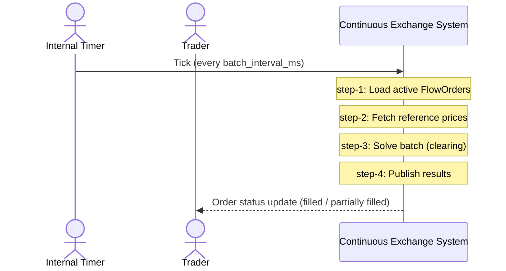

# F-04 — Batch Clearing Cycle

> **Статус:** in-progress. Solver, метрики, Market Data integration, отдельный
> `fills` топик, PostgreSQL источник, multi-leg legs в схеме — все есть. Pending
> зоны выделены ниже отдельно.

## 🧭 Navigation Map (IN-013 drill-down)

Эта секция — **карта документации сверху вниз**. Каждый уровень имеет
свой ответ на «что/как», и каждая ссылка ведёт на следующий уровень
детализации.

```text
   ┌─ Уровень ──────────────┬─ Артефакт ─────────────────────────────────┐
☁️ L0 │ Что система делает    │ Эта страница (overview + L0 sequence ниже) │
   │ для внешнего мира?     │                                            │
🌊 L1 │ Какие функции у фичи?  │ Use Cases (таблица ниже)                   │
   │ Какие сервисы участвуют?│ L1 service sequence (ниже)                 │
🐟 L2 │ Из каких классов       │ Component overview + L2 sequences          │
   │ состоит сервис?        │ → matching-fob-core/overview.md            │
   │ Как функция исполняется │ Per-UC L2 sequences (в use-case.md)        │
   │ через классы?          │                                            │
💻 src │ Код                    │ cpp/matching/src/...                       │
   └────────────────────────┴────────────────────────────────────────────┘
```

**Быстрый старт по drill-down:**

1. **L0 ☁️** Прочитайте описание ниже + откройте
   [L0 system sequence](../../use-cases/UC-F04-01-run-batch-clearing/sequences/SEQ-UC-F04-01-system.md)
   — система как чёрный ящик, видны только внешние эффекты.
2. **L1 🌊** Перейдите к Use Cases (таблица ниже) → каждый UC раскрывает
   одну функцию фичи. Для UC-F04-01 откройте
   [L1 service sequence](../../../05-components/sequences/SEQ-F04-UC-F04-01-services.md)
   — видны сервисы matching/risk/ledger/market_data и контракты между ними.
3. **L2 🐟** Откройте
   [matching-fob-core component overview](../../../05-components/matching-fob-core/overview.md)
   — увидите классы внутри сервиса. Затем
   [L2 solver-cycle sequence](../../../05-components/matching-fob-core/sequences/SEQ-MATCHING-001-solver-cycle.md)
   — как один цикл клиринга проходит через классы.
4. **💻 Код** — [cpp/matching/](../../../../cpp/matching/) (ссылки на конкретные файлы внизу).

## 📋 Use Cases (L1 🌊)

| UC | Имя | L0 sequence ☁️ | L1 sequence 🌊 | Status |
| --- | --- | --- | --- | --- |
| [UC-F04-01](../../use-cases/UC-F04-01-run-batch-clearing/use-case.md) | Run Batch Clearing Cycle | [SEQ-UC-F04-01-system](../../use-cases/UC-F04-01-run-batch-clearing/sequences/SEQ-UC-F04-01-system.md) | [SEQ-F04-UC-F04-01-services](../../../05-components/sequences/SEQ-F04-UC-F04-01-services.md) | in-progress |

## 🏗 Components Involved

| Component | Role | Drill-down → L2 🐟 |
| --- | --- | --- |
| [matching-fob-core](../../../05-components/matching-fob-core/overview.md) | Solver + batch loop (owner of F-04) | [SEQ-MATCHING-001-solver-cycle](../../../05-components/matching-fob-core/sequences/SEQ-MATCHING-001-solver-cycle.md) |
| [market-data](../../../05-components/market-data/) | Reference prices (gRPC) | (L2 TBD) |
| [ledger](../../../05-components/ledger/) | Apply fills → balances | (L2 TBD) |
| [risk](../../../05-components/risk-manager/) | Post-trade alerts (consumer of `batch.outputs`) | (L2 TBD) |
| [observability](../../../05-components/observability-reporting/) | Metrics + alerts | (L2 TBD) |

## ☁️ L0 — System view (preview)

Полная диаграмма с описанием шагов — в
[SEQ-UC-F04-01-system.md](../../use-cases/UC-F04-01-run-batch-clearing/sequences/SEQ-UC-F04-01-system.md).



> ⚠️ Эта диаграмма — preview уровня L0. Согласно IN-013 §3 (sequence rules),
> на L0 запрещено упоминать внутренние сервисы. Их видно на L1 — см. ниже.

## Описание

Периодический батч-клиринг активных FlowOrder. Каждые `batchIntervalMs` мс solver вычисляет клиринговые цены и скорости исполнения, формирует `BatchResult` и набор `FillEvent`, публикует в Kafka.

## Ключевые сущности

- **Batch** — один шаг клиринга.
- **BatchResult** — сводка батча. Proto: [`fob.matching.v1.BatchResult`](../../../../contracts/proto/fob/matching/v1/batch.proto).
- **FillEvent** — конкретное исполнение конкретного FlowOrder.
- **clearPrices** — вектор равновесных цен по инструментам.
- **executedRates** — итоговые скорости исполнения.
- **residualNorm** — мера невязки спроса/предложения. Меньше — лучше.
- **solveTimeMs** — время работы solver'а (для SLA).

## Реализация

- [cpp/matching/src/app/matching_loop.cpp](../../../../cpp/matching/src/app/matching_loop.cpp) — batch loop, fallback PG vs in-memory.
- [cpp/matching/src/app/run_batch_uc.cpp](../../../../cpp/matching/src/app/run_batch_uc.cpp) — один прогон, `steady_clock` измерение `solve_time_ms`.
- [cpp/matching/src/domain/solver_impl.cpp](../../../../cpp/matching/src/domain/solver_impl.cpp) — `ContinuousClearingSolver` на Eigen с расчётом `residual_norm` через дисбаланс по символам.
- [cpp/matching/src/infra/postgres/postgres_flow_order_repository.cpp](../../../../cpp/matching/src/infra/postgres/postgres_flow_order_repository.cpp) — `LoadActiveFlowOrders()` фильтрует `status IN ('active','partially_filled')`, `filled_cum < q_max`, `time_in_force <> 'IOC'` и LEFT JOIN'ит `flow_order_legs`.
- [cpp/matching/src/infra/kafka/batch_outputs_producer.cpp](../../../../cpp/matching/src/infra/kafka/batch_outputs_producer.cpp) — публикует `batch.outputs` и (отдельно по каждому fill) `fills`.
- [cpp/matching/src/infra/market_data/market_data_client.cpp](../../../../cpp/matching/src/infra/market_data/market_data_client.cpp) — gRPC `MarketDataService.GetLastTicker` для reference price (`last` или mid(bid,ask)).

## Acceptance criteria

См. [acceptance-criteria.md](acceptance-criteria.md).

## Известные несоответствия спецификации

См. [feature.yaml](feature.yaml) → `knownIssues`.

### Критические (denежные, не закрыты)

1. **Утечка резерва при BUY** — после полного fill в reserved висит разница `(price_high - midpoint) * qty`. См. F-02 `buy-reserve-leak`.
2. **Двойной учёт при cancel после partial fill** — ledger снимает оригинальную сумму резерва, а не остаток. См. F-02 `cancel-double-count`.

### Открытые архитектурные gap'ы

3. **ClickHouse ingestion для `batch.outputs`/`fills` ещё не подключён** — таблицы есть, но Kafka→CH консьюмер только в follow-up PR (см. `feature.yaml` → `clickhouse-ingestion-pending`). До этого `batchresults`/`fills` в CH пустые; UI «Батчи / Профиль» при отсутствии BATCHES_SIMULATE=1 покажет только статичный seed.
4. **Solver fallback при non-convergence** — есть `degraded`-флаг в diagnostics, но reflex-стратегии (epsilon-MM / halt) ещё нет (TODO в `run_batch_uc.cpp`).
5. **Multi-leg / portfolio orders** — domain (`FlowOrderLeg`, `weight`) и PG-схема (`flow_order_legs`) готовы; пользовательский ввод (F-02 single-leg) и solver для портфельных весов — следующий шаг (F-09).
6. **SLA-метрики/алерты для p50/p95 solver'а** — `solve_time_ms` пишется в `BatchResult.diagnostics`, но prometheus-histogram и алерт-thresholds — TODO (см. NFR-EXEC-002).

### Закрытые ранее заявленные gap'ы

- ~~«Нет настоящего солвера»~~ — `ContinuousClearingSolver` (Eigen-based) активен ([solver_impl.cpp](../../../../cpp/matching/src/domain/solver_impl.cpp)).
- ~~«residualNorm = 0.0 захардкожен»~~ — считается как max дисбаланса по символам.
- ~~«solveTimeMs = 1 захардкожен»~~ — измеряется через `steady_clock` в `run_batch_uc.cpp`.
- ~~«executed_rates показывает max_speed»~~ — `executed_rate = executed_qty * 1000 / batch_interval_ms`.
- ~~«Источник — Kafka вместо PostgreSQL»~~ — при `MATCHING_POSTGRES_DSN` MatchingLoop использует `PostgresFlowOrderRepository`; PR-F02-001 добавил недостающий writer в `order_flow`, замкнув цикл.
- ~~«Нет интеграции с Market Data»~~ — `MarketDataClient.GetLastTicker` подключён.
- ~~«Один топик `batch.outputs` вместо двух (нет `fills`)»~~ — `fills` создаётся в `infra/kafka/create_topics.sh` и пишется в `BatchOutputsProducer`.
- ~~«Нет `liquidity_source`/`fees`/`fill_id`»~~ — поля присутствуют в proto `FillEvent` и заполняются.

## Связанные фичи

- F-02 (Create FlowOrder) — поставщик `orders.normalized`
- F-06 (Positions / PnL / Margin) — потребитель `batch.outputs`
- F-07 (Pre-trade Risk) — pre-trade гейт
- F-09 (Batch / Combo Orders) — расширение F-04 на multi-leg
- F-11 (External Venues LOB → FOB) — внешняя ликвидность
- F-12 (Execution Hedge) — после внутреннего клиринга

## Traceability

См. [traceability.yaml](traceability.yaml).

## Acceptance Criteria (IN-001)

Система должна регулярно (каждые `batch_interval_ms`) находить равновесную цену и скорости исполнения, распределять объём по всем активным заявкам и фиксировать факты сделок (`FillEvent`).

- `BatchResult` сохраняет diagnostics: `residual_norm`, `solve_time_ms`, `num_active_orders`, `config_version`.
- Replay с тем же входом и `config_version` даёт идентичный результат (F-15).
- Fills атомарно применяются к Ledger по `batch_id + order_id` (идемпотентно).
- Solver SLA: p50 ≤ 200 ms, p95 ≤ 500 ms.

Источник: IN-001 §6 FR-CLEAR-001/002, §7 NFR-EXEC-002.

## Detailed spec (IN-003)

Полное описание — в архиве [`incoming-docs/2026-05-13-F-04-Batch-Clearing-v1.md`](../../../../incoming-docs/2026-05-13-F-04-Batch-Clearing-v1.md). Ключевые акценты ниже.

### Бизнес-цели F-04

- Честное и детерминированное исполнение FlowOrder в батчах с учётом их лимитов `p_L`, `p_H`, `q_rate`, `Q_max`.
- SLA по solve time: median ≤ 500 ms, p95 ≤ 1000 ms (MVP); подробная разбивка по размеру батча — в [non-functional-requirements §NFR-EXEC-002](../../non-functional-requirements.md).

### Альтернативные сценарии

1. **Нет активных заявок** — пустой `BatchResult` (без FillEvent); метрика «пустой батч» в Observability.
2. **Солвер не сошёлся** (`residual_norm > tolerance` или `max_iterations`) — `BatchResult` с флагом `degraded`; `risk.alerts(SOLVER_NOT_CONVERGED)`; опциональный fallback на epsilon-MM или остановка торгов.
3. **Нарушен SLA `solve_time_ms`** — `BatchResult` с признаком `sla_breach`; alert; возможный kill-switch (F-16).

Подробные диаграммы — в [UC-F04-01 use-case Alternative Flows](../../use-cases/UC-F04-01-run-batch-clearing/use-case.md#alternative-flows).

### UX / UI

Три экрана:

- **Торговля / Активные заявки** — FlowOrders с `filled_cum`, лимиты `p_L`, `p_H`, `q_rate`, `Q_max`, фильтры, действия.
- **Исполнения / История клиринга** — список FillEvent с ценой, объёмом, `batch_id`, `liquidity_source` (internal / cex_hedge / dex_hedge / epsilon_mm).
- **Диагностика клиринга** — для операторов: `clear_prices`, `executed_rates`, `residual_norm`, `solve_time_ms` по батчам, drill-down в FillEvent.

### Definition of Done

См. [implementation-plan/F-04-batch-clearing.tasks.md → DoD](../../../implementation-plan/F-04-batch-clearing.tasks.md#definition-of-done-in-003).

### Тест-план

См. [10-testing/features/F-04-test-plan.md](../../../10-testing/features/F-04-test-plan.md) — юнит-тесты U1–U10, SLA-таблица по размеру батча, ручные сценарии.

### Внутренняя последовательность

См. [SEQ-MATCHING-001-solver-cycle](../../../05-components/matching-fob-core/sequences/SEQ-MATCHING-001-solver-cycle.md) — internal cycle (Scheduler → RunBatch → loadActiveFlowOrders → getReferencePrices → solveBatch → publish).

## Source Fragments

- IN-001-FR-027, IN-001-FR-028
- IN-003-FR-006 (deterministic execution)
- IN-003-FR-007 (область применения, stakeholders)
- IN-003-FR-008 (цели F-04)
- IN-003-FR-011 (alternative flows)
- IN-003-FR-012 (UX/UI)
- IN-003-FR-013 (критерии успеха)
