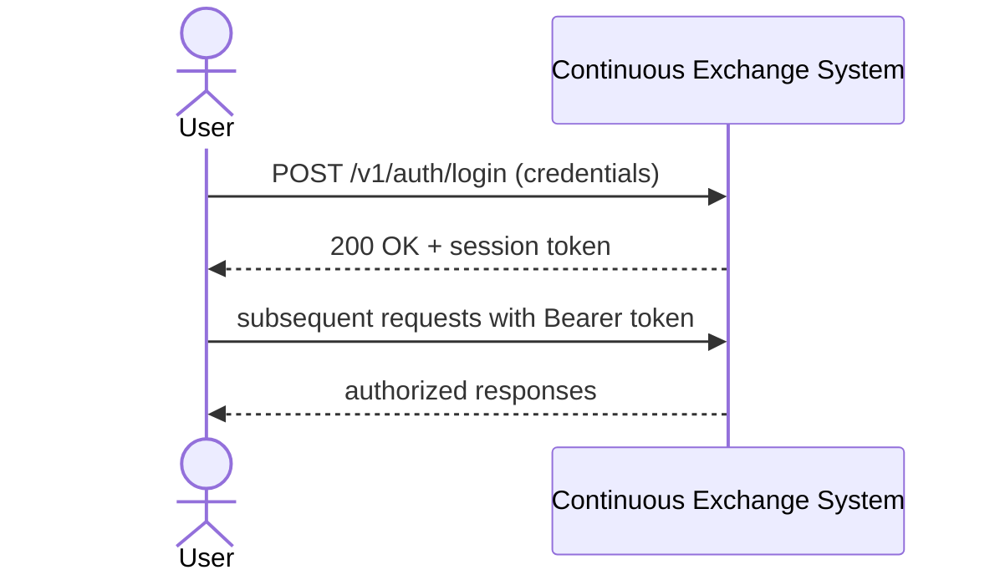

# SEQ-UC-F01-01-system. Authentication: system view

## Type

System Context Sequence

## Feature

- [F-01](../../../features/F-01-auth-and-identity/)

## Use Case

- [UC-F01-01](../use-case.md)

## Purpose

Показать вход внешнего пользователя в систему как черный ящик.

## Participants

- Trader / Operator
- Continuous Exchange System

## Diagram

## Related Service Sequence

- [SEQ-F01-UC-F01-01-services](../../../../05-components/sequences/SEQ-F01-UC-F01-01-services.md)

## Related Contracts

- (планируется) `POST /v1/auth/login`
