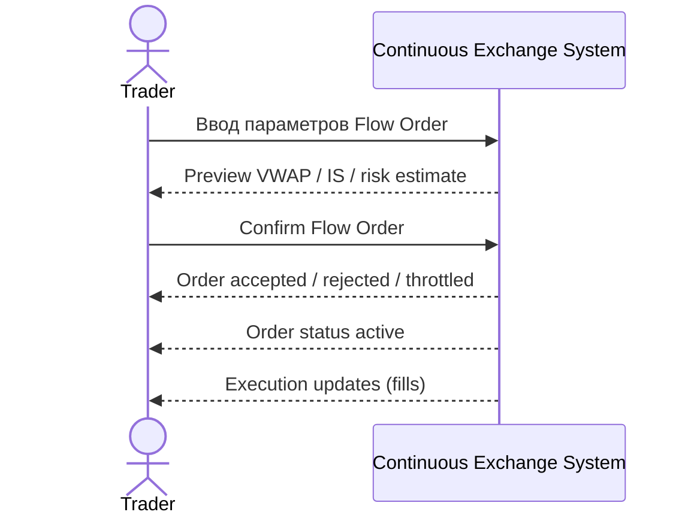

# SEQ-UC-F02-01-system. Create FlowOrder: system view

## Type

System Context Sequence

## Feature

- [F-02](../../../features/F-02-create-floworder/)

## Use Case

- [UC-F02-01](../use-case.md)

## Purpose

Trader взаимодействует с Continuous Exchange System как с черным ящиком: задаёт параметры FlowOrder, получает preview, подтверждает, получает статус и поток обновлений.

## Participants

- Trader
- Continuous Exchange System

## Diagram

## Related Service Sequence

- [SEQ-F02-UC-F02-01-services](../../../../05-components/sequences/SEQ-F02-UC-F02-01-services.md)

## Related Contracts

- `POST /v1/flow-orders` — [../../../../06-api/rest/](../../../../06-api/rest/)
- WebSocket `OrderStatusUpdate` (планируется)
