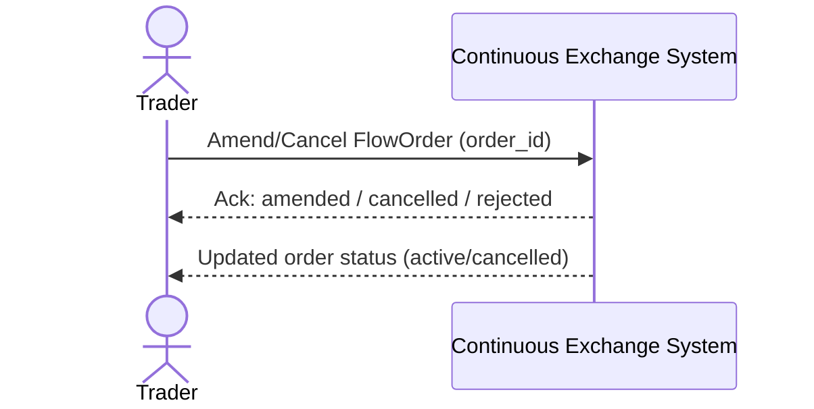

# SEQ-UC-F03-01-system. Amend/Cancel FlowOrder: system view

## Type

System Context Sequence

## Feature

- [F-03](../../../features/F-03-order-lifecycle/)

## Use Case

- [UC-F03-01](../use-case.md)

## Participants

- Trader
- Continuous Exchange System

## Diagram

## Related Service Sequence

- [SEQ-F03-UC-F03-01-services](../../../../05-components/sequences/SEQ-F03-UC-F03-01-services.md)
