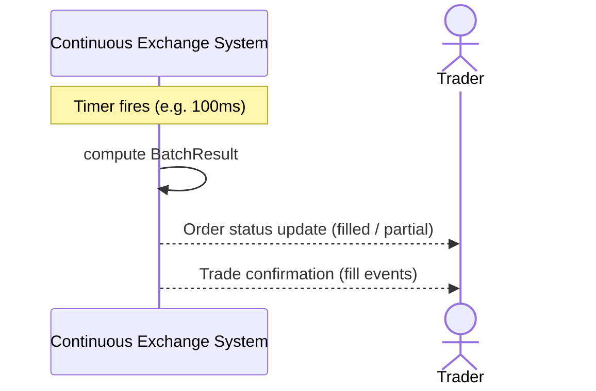

# SEQ-UC-F04-01-system. Batch Clearing: system view

## Type

System Context Sequence

## Feature

- [F-04](../../../features/F-04-batch-clearing/)

## Use Case

- [UC-F04-01](../use-case.md)

## Purpose

Batch clearing — внутренний системный сценарий, инициируемый таймером. Внешним участникам видны только следствия: обновление статусов заявок и публикация fills.

## Participants

- Continuous Exchange System
- Trader (получатель уведомлений о fills)

## Diagram

## Related Service Sequence

- [SEQ-F04-UC-F04-01-services](../../../../05-components/sequences/SEQ-F04-UC-F04-01-services.md)
