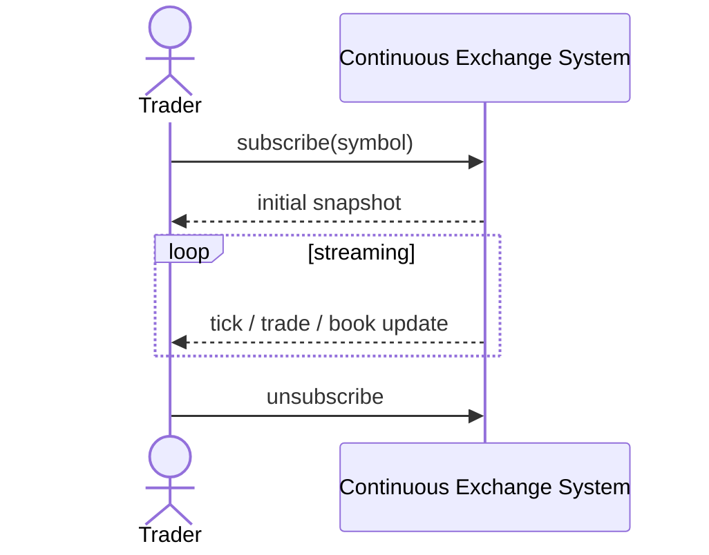

# SEQ-UC-F05-01-system. Live Market Data: system view

## Type

System Context Sequence

## Feature

- [F-05](../../../features/F-05-live-market-data/)

## Use Case

- [UC-F05-01](../use-case.md)

## Participants

- Trader / Market Maker
- Continuous Exchange System

## Diagram

## Related Service Sequence

- [SEQ-F05-UC-F05-01-services](../../../../05-components/sequences/SEQ-F05-UC-F05-01-services.md)
