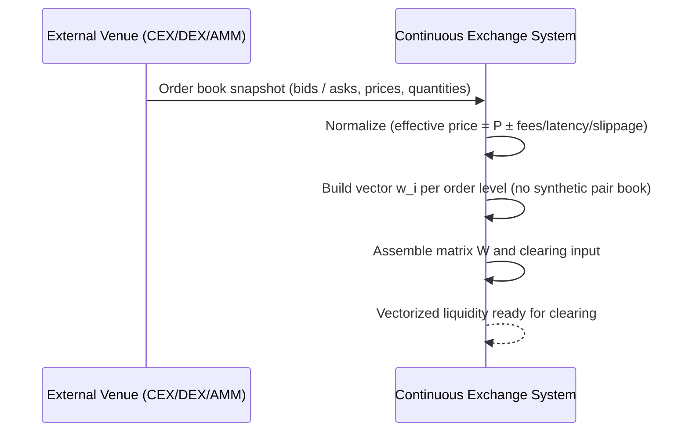

<!--
---
id: SEQ-UC-F05A-01-system
title: "Vectorize External Order Book: system view"
level: kite
parent-uc: UC-F05A-01
---
-->

# SEQ-UC-F05A-01-system. Vectorize External Order Book: system view

## Type

System Context Sequence (L0 ☁️)

## Feature

- [F-05A. Vectorized External Liquidity](../../../features/F-05-live-market-data/addendum-F05A-vectorized-external-liquidity.md)

## Use Case

- [UC-F05A-01](../use-case.md)

## Purpose

Показать, как внешняя биржа (venue) поставляет стакан, а Continuous Exchange System
как **black box** превращает его в vectorized liquidity — без раскрытия внутренних сервисов.

## Participants

- External Venue (CEX / DEX / AMM)
- Continuous Exchange System

## Diagram

## Related Service Sequence

- [../../../../05-components/sequences/SEQ-F05A-UC-F05A-01-services.md](../../../../05-components/sequences/SEQ-F05A-UC-F05A-01-services.md)

## Related Contracts

- External venue order book APIs (Binance `/api/v3/depth`, Coinbase product book, Kraken `/Depth`)
