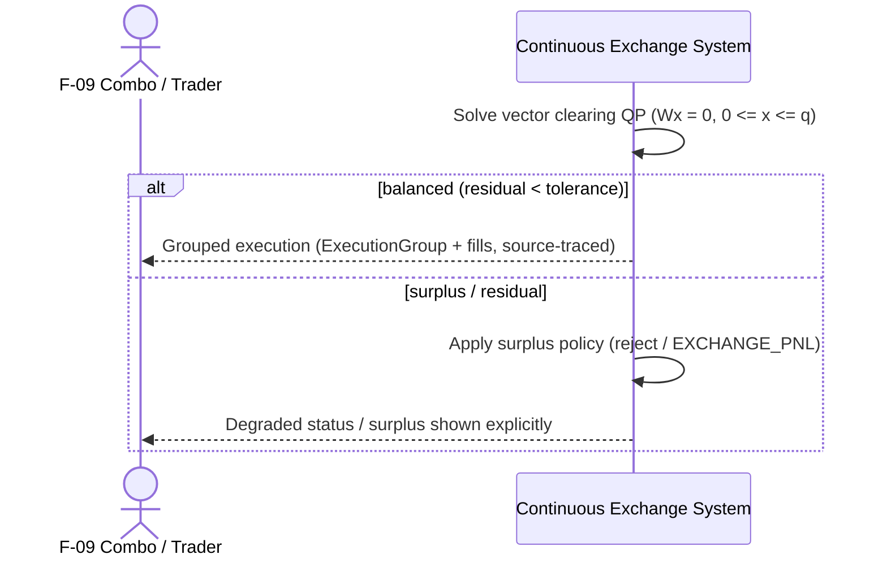

<!--
---
id: SEQ-UC-F05A-02-system
title: "Run Vector Clearing: system view"
level: kite
parent-uc: UC-F05A-02
---
-->

# SEQ-UC-F05A-02-system. Run Vector Clearing: system view

## Type

System Context Sequence (L0 ☁️)

## Feature

- [F-05A. Vectorized External Liquidity](../../../features/F-05-live-market-data/addendum-F05A-vectorized-external-liquidity.md)

## Use Case

- [UC-F05A-02](../use-case.md)

## Purpose

Показать клиринг внешней ликвидности как black box: система решает QP и балансирует
активы (`Wx=0`), возвращая grouped execution; surplus, если возник, показывается явно.

## Participants

- F-09 Combo/Trader (косвенный потребитель grouped execution)
- Continuous Exchange System

## Diagram

## Related Service Sequence

- [../../../../05-components/sequences/SEQ-F05A-UC-F05A-02-services.md](../../../../05-components/sequences/SEQ-F05A-UC-F05A-02-services.md)

## Related Contracts

- [execution.groups](../../../../06-api/messaging/execution-groups.md)
