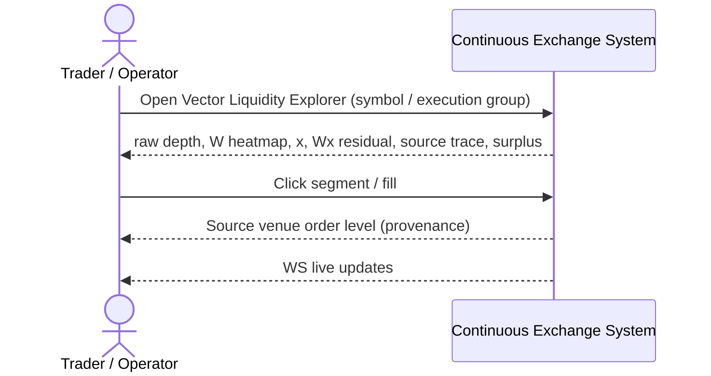

<!--
---
id: SEQ-UC-F05A-03-system
title: "Display Vector Liquidity: system view"
level: kite
parent-uc: UC-F05A-03
---
-->

# SEQ-UC-F05A-03-system. Display Vector Liquidity: system view

## Type

System Context Sequence (L0 ☁️)

## Feature

- [F-05A. Vectorized External Liquidity](../../../features/F-05-live-market-data/addendum-F05A-vectorized-external-liquidity.md)

## Use Case

- [UC-F05A-03](../use-case.md)

## Purpose

Показать, как пользователь получает доказательные графики vector clearing от системы (black box).

## Participants

- Trader / Operator
- Continuous Exchange System

## Diagram

## Related Service Sequence

- [../../../../05-components/sequences/SEQ-F05A-UC-F05A-03-services.md](../../../../05-components/sequences/SEQ-F05A-UC-F05A-03-services.md)

## Related Contracts

- REST `/api/v1/marketdata/vector-liquidity*`, WS `/api/market/vector` (planned)
