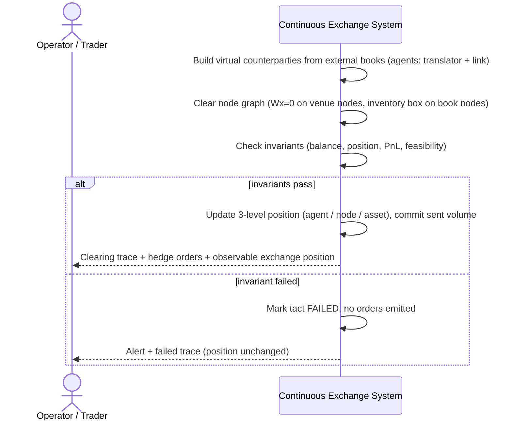

<!--
---
id: SEQ-UC-F05A-06-system
title: "Run CE Tact with Virtual Counterparties: system view"
level: kite
parent-uc: UC-F05A-06
---
-->

# SEQ-UC-F05A-06-system. Run CE Tact with Virtual Counterparties: system view

## Type

System Context Sequence (L0 ☁️)

## Feature

- [F-05A. Vectorized External Liquidity](../../../features/F-05-live-market-data/addendum-F05A-vectorized-external-liquidity.md)

## Use Case

- [UC-F05A-06](../use-case.md)

## Purpose

Показать такт CE как black box: система строит виртуальных контрагентов из внешних книг,
клирингует граф узлов, проверяет инварианты и — при превышении порогов позиции — выставляет
хедж-поручения во внешний мир; позиция биржи наблюдаема на каждом такте.

## Participants

- Operator / Trader (косвенный потребитель трассы такта и позиции)
- Continuous Exchange System

## Diagram

## Related Service Sequence

- [../../../../05-components/sequences/SEQ-F05A-UC-F05A-06-services.md](../../../../05-components/sequences/SEQ-F05A-UC-F05A-06-services.md)

## Related Contracts

- Kafka `matching.clearing_trace` (planned), `ce.position.delta`, `execution.intents`
