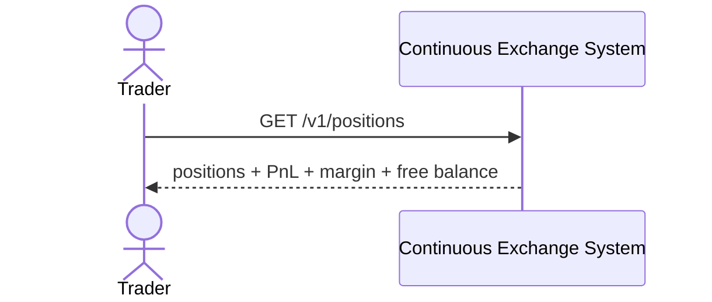

# SEQ-UC-F06-01-system. Positions: system view

## Type

System Context Sequence

## Feature

- [F-06](../../../features/F-06-positions-pnl-margin/)

## Use Case

- [UC-F06-01](../use-case.md)

## Participants

- Trader
- Continuous Exchange System

## Diagram

## Related Service Sequence

- [SEQ-F06-UC-F06-01-services](../../../../05-components/sequences/SEQ-F06-UC-F06-01-services.md)
