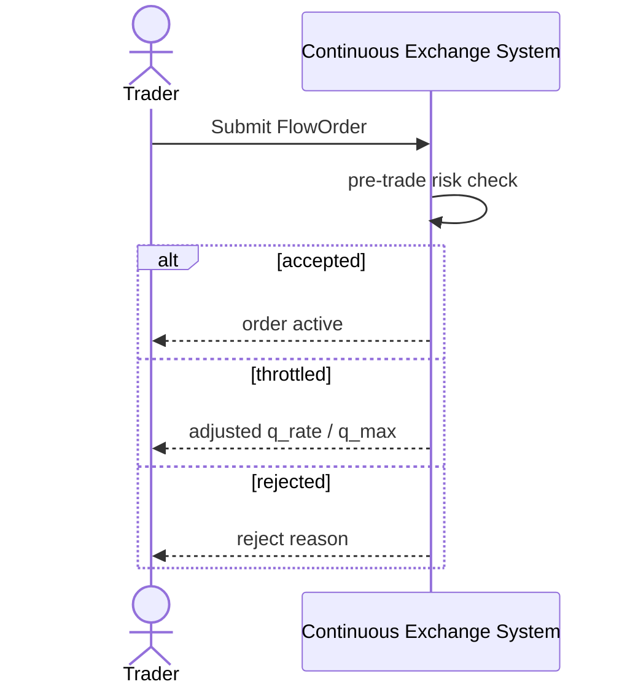

# SEQ-UC-F07-01-system. Pre-trade Risk: system view

## Type

System Context Sequence

## Feature

- [F-07](../../../features/F-07-pretrade-risk/)

## Use Case

- [UC-F07-01](../use-case.md)

## Purpose

Внешне видно как часть Create FlowOrder — система возвращает accept/reject/throttle.

## Participants

- Trader
- Continuous Exchange System

## Diagram

## Related Service Sequence

- [SEQ-F07-UC-F07-01-services](../../../../05-components/sequences/SEQ-F07-UC-F07-01-services.md)
