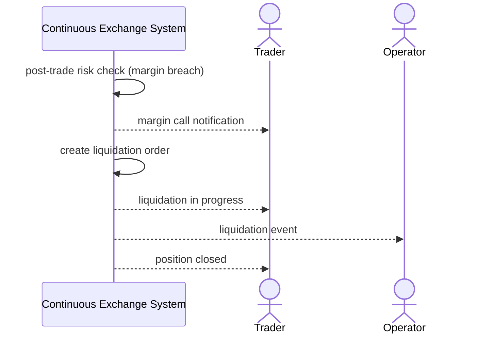

# SEQ-UC-F08-01-system. Liquidation: system view

## Type

System Context Sequence

## Feature

- [F-08](../../../features/F-08-posttrade-risk-and-liquidations/)

## Use Case

- [UC-F08-01](../use-case.md)

## Participants

- Trader
- Continuous Exchange System
- Operator

## Diagram

## Related Service Sequence

- [SEQ-F08-UC-F08-01-services](../../../../05-components/sequences/SEQ-F08-UC-F08-01-services.md)
