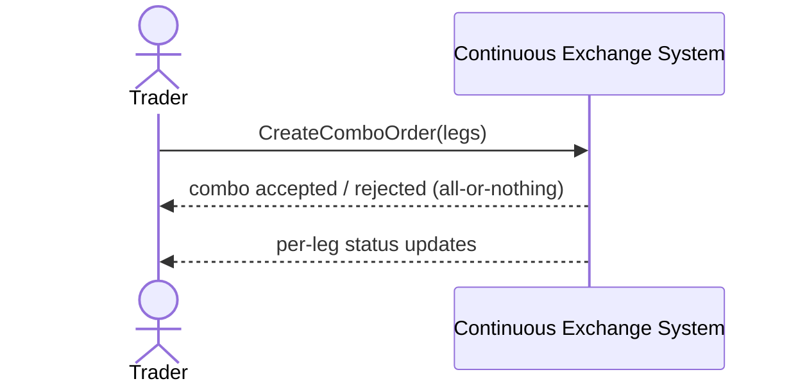

# SEQ-UC-F09-01-system. Combo Order: system view

## Type

System Context Sequence

## Feature

- [F-09](../../../features/F-09-batch-combo-orders/)

## Use Case

- [UC-F09-01](../use-case.md)

## Participants

- Trader
- Continuous Exchange System

## Diagram

## Related Service Sequence

- [SEQ-F09-UC-F09-01-services](../../../../05-components/sequences/SEQ-F09-UC-F09-01-services.md)
