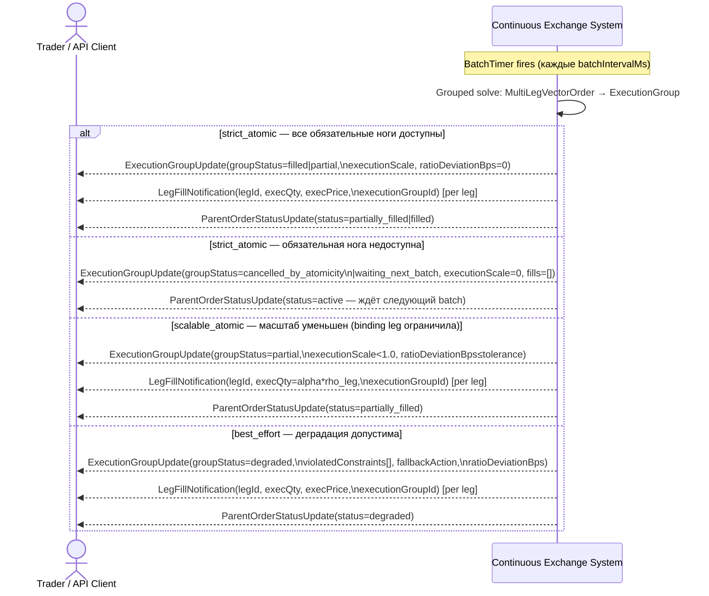

# SEQ-UC-F09-02-system. Grouped Matching (batch cycle): system view

## Type

System Context Sequence

## Feature

- [F-09. Batch, Combo and Multi-leg Orders](../../../features/F-09-batch-combo-orders/)

## Use Case

- [UC-F09-02. Grouped matching внутри batch cycle](../use-case.md)

## Purpose

Показывает с точки зрения внешнего наблюдателя (Trader), что происходит в каждом batch cycle (batchIntervalMs) при наличии активных многоногих заявок в `multileg_vector_solver`. Continuous Exchange System — непрозрачный блок. Trader видит только обновления статусов группы и ног.

Сценарий охватывает:
- штатный исход (`scalable_atomic` или `strict_atomic` — группа исполнена);
- исход деградации (`best_effort`, `scalable_atomic` уменьшил масштаб);
- исход отказа `strict_atomic` (обязательная нога недоступна → `cancelled_by_atomicity` / `waiting_next_batch`).

## Participants

- Trader / API Client
- Continuous Exchange System

## Diagram

## Related Service Sequence

- [SEQ-F09-UC-F09-02-services](../../../../05-components/sequences/SEQ-F09-UC-F09-02-services.md)

## Related Feature

- [F-09](../../../features/F-09-batch-combo-orders/)

## Related ADR

- [ADR-031](../../../../03-architecture/adr/ADR-031-multileg-execution-modes-atomicity.md)
- [ADR-033](../../../../03-architecture/adr/ADR-033-execution-groups-topic.md) — топик `execution.groups`

## Source

- IN-011 §7 UC-F09-002, §9, §10, §11.3–§11.4, §15.3, §16
