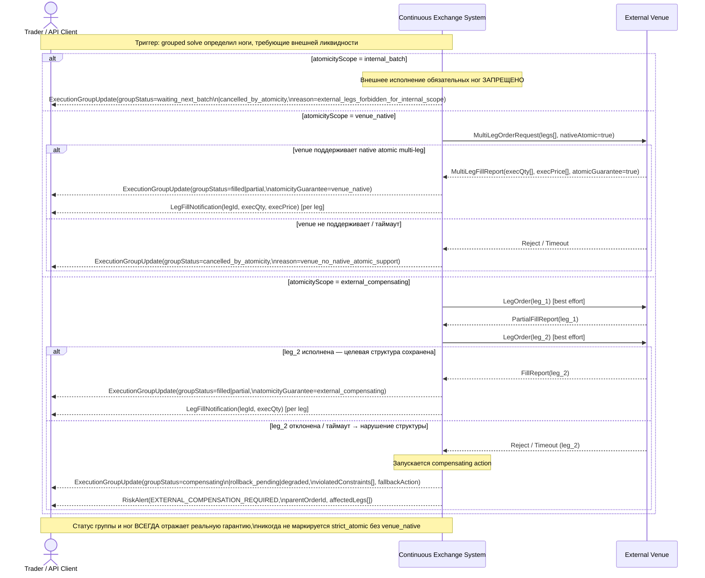

<!-- IN-013 frontmatter — Cockburn decomposition level.
---
id: SEQ-UC-F09-03-system
level: kite
---
-->

# SEQ-UC-F09-03-system. External Leg Execution / Compensating: system view

## Type

System Context Sequence

## Feature

- [F-09. Batch, Combo and Multi-leg Orders](../../../features/F-09-batch-combo-orders/)

## Use Case

- [UC-F09-03. External leg execution / compensating](../use-case.md)

## Purpose

Показывает внешним акторам (Trader и External Venue) взаимодействие с Continuous Exchange System при маршрутизации ног многоногой заявки на внешние площадки. Ветвление по `atomicityScope` (internal_batch / venue_native / external_compensating) и возможные исходы: заполнение, деградация, компенсация.

Continuous Exchange System — непрозрачный блок. Внутренние компоненты (execution-planning, venue-execution-adapter) не видны — виден только External Venue как внешний участник.

## Participants

- Trader / API Client
- Continuous Exchange System
- External Venue

## Diagram

## Related Service Sequence

- [SEQ-F09-UC-F09-03-services](../../../../05-components/sequences/SEQ-F09-UC-F09-03-services.md)

## Related Feature

- [F-09](../../../features/F-09-batch-combo-orders/)

## Related ADR

- [ADR-031](../../../../03-architecture/adr/ADR-031-multileg-execution-modes-atomicity.md) — atomicityScope и политики
- [ADR-033](../../../../03-architecture/adr/ADR-033-execution-groups-topic.md)

## Source

- IN-011 §7 UC-F09-003, §2.2, §10.5, §12.7, §12.8, §15.3
