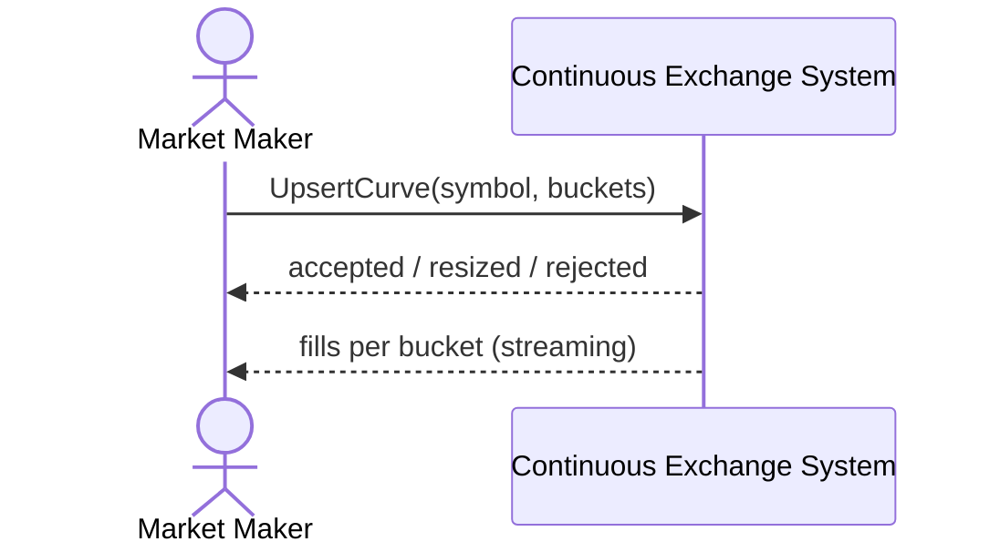

# SEQ-UC-F10-01-system. MM Curve: system view

## Type

System Context Sequence

## Feature

- [F-10](../../../features/F-10-mm-curves/)

## Use Case

- [UC-F10-01](../use-case.md)

## Participants

- Market Maker
- Continuous Exchange System

## Diagram

## Related Service Sequence

- [SEQ-F10-UC-F10-01-services](../../../../05-components/sequences/SEQ-F10-UC-F10-01-services.md)
