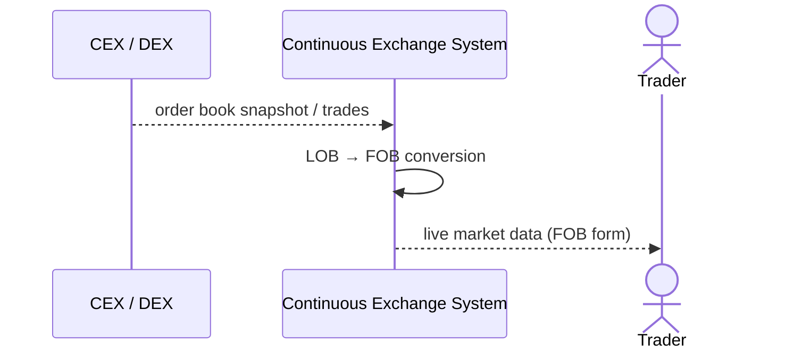

# SEQ-UC-F11-01-system. External Market Data: system view

## Type

System Context Sequence

## Feature

- [F-11](../../../features/F-11-external-venues-lob-to-fob/)

## Use Case

- [UC-F11-01](../use-case.md)

## Participants

- CEX / DEX
- Continuous Exchange System
- Trader (косвенно — получает обновлённый market data)

## Diagram

## Related Service Sequence

- [SEQ-F11-UC-F11-01-services](../../../../05-components/sequences/SEQ-F11-UC-F11-01-services.md)
