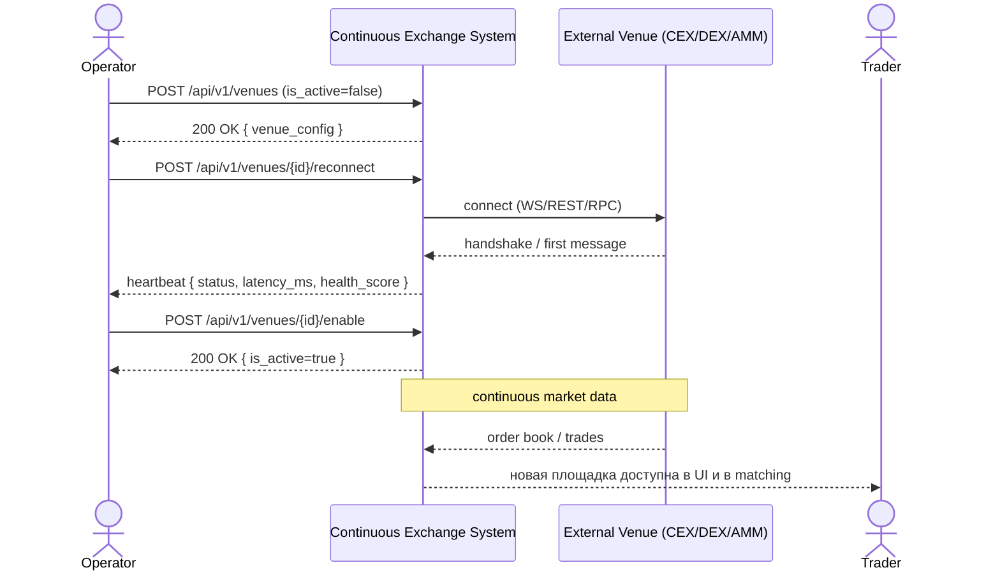

<!-- IN-013 frontmatter — Cockburn decomposition level.
---
id: SEQ-UC-F11-01-system
level: kite
---
-->

# SEQ-UC-F11-01-system. Onboard venue: system view

## Type

System Context Sequence

## Feature

- [F-11](../../../features/F-11-external-venues-lob-to-fob/)

## Use Case

- [UC-F11-01](../use-case.md)

## Purpose

Показать «чёрный ящик» онбординга площадки: оператор подаёт конфиг → Continuous Exchange System делает test-then-commit и начинает публиковать market-data + health.

## Participants

- Operator (актор)
- Continuous Exchange System
- Внешняя площадка (CEX / DEX / AMM)
- Trader (косвенный наблюдатель — видит новую площадку в UI после активации)

## Diagram

## Related Service Sequence

- [SEQ-F11-01-onboard-venue-services](../../../../05-components/sequences/SEQ-F11-01-onboard-venue-services.md)
