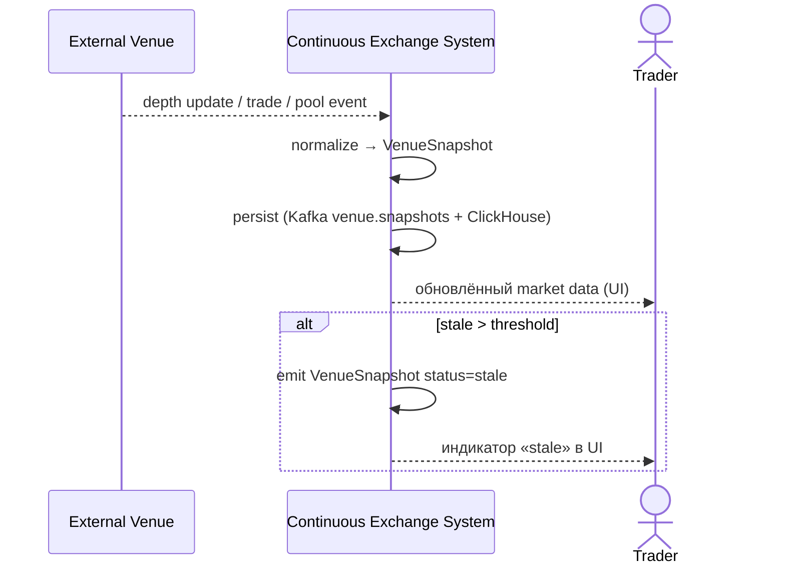

# SEQ-UC-F11-02-system. Publish VenueSnapshot: system view

## Type

System Context Sequence

## Feature

- [F-11](../../../features/F-11-external-venues-lob-to-fob/)

## Use Case

- [UC-F11-02](../use-case.md)

## Purpose

Чёрный ящик ingest'а данных от внешней площадки: venue шлёт raw → Continuous Exchange System нормализует и публикует `VenueSnapshot`. Trader/Matching видят это как обновление market data.

## Participants

- Внешняя площадка (CEX / DEX / AMM)
- Continuous Exchange System
- Trader (косвенно — через UI/market data)

## Diagram

## Related Service Sequence

- [SEQ-F11-02-publish-snapshot-services](../../../../05-components/sequences/SEQ-F11-02-publish-snapshot-services.md)
