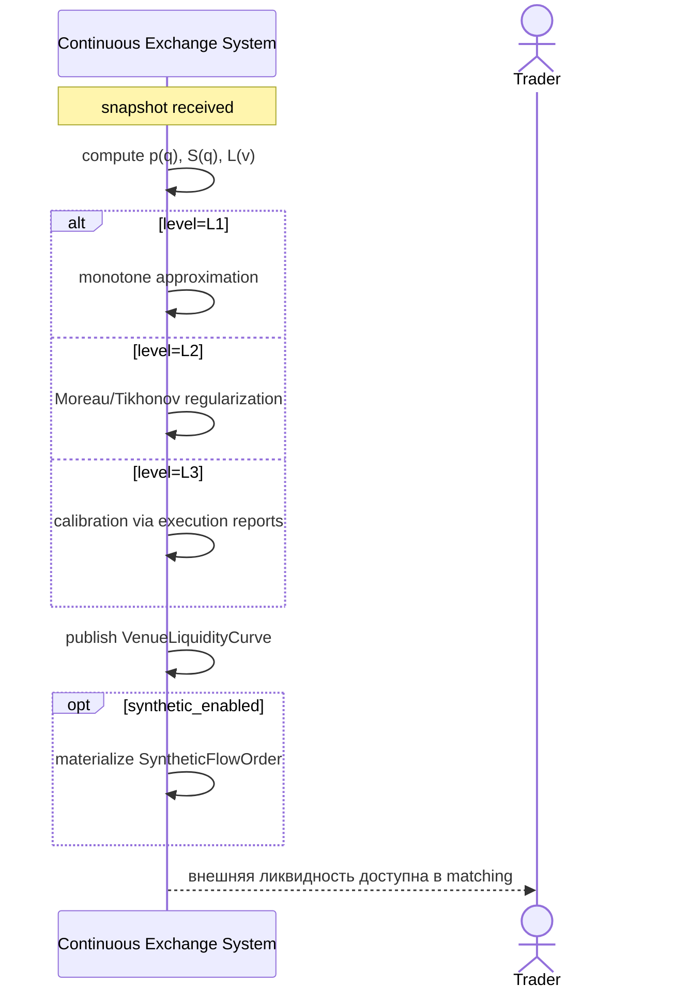

<!-- IN-013 frontmatter — Cockburn decomposition level.
---
id: SEQ-UC-F11-03-system
level: kite
---
-->

# SEQ-UC-F11-03-system. Build VenueLiquidityCurve: system view

## Type

System Context Sequence

## Feature

- [F-11](../../../features/F-11-external-venues-lob-to-fob/)

## Use Case

- [UC-F11-03](../use-case.md)

## Purpose

LOB → FOB конверсия — внутренний системный шаг, не виден внешним участникам напрямую. Trader/Matching видят следствие — обновлённую FOB-кривую как источник внешней ликвидности.

## Participants

- Continuous Exchange System
- Trader (косвенно)
- Matching / Execution Planning (внутри S, но визуализированы здесь как наблюдатели)

## Diagram

## Related Service Sequence

- [SEQ-F11-03-build-curve-services](../../../../05-components/sequences/SEQ-F11-03-build-curve-services.md)
