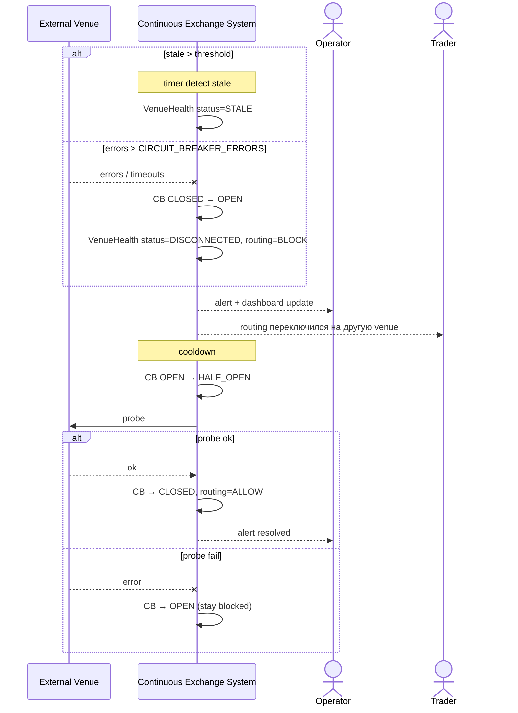

# SEQ-UC-F11-04-system. Venue health degradation: system view

## Type

System Context Sequence

## Feature

- [F-11](../../../features/F-11-external-venues-lob-to-fob/)

## Use Case

- [UC-F11-04](../use-case.md)

## Purpose

Показать, что видят внешние участники при деградации площадки: оператор получает alert, трейдеры видят индикатор и автоматическое переключение routing'а. Continuous Exchange System внутри сама детектирует и реагирует.

## Participants

- Внешняя площадка
- Continuous Exchange System
- Operator (получатель alert'а)
- Trader (наблюдает routing)

## Diagram

## Related Service Sequence

- [SEQ-F11-04-health-routing-services](../../../../05-components/sequences/SEQ-F11-04-health-routing-services.md)
