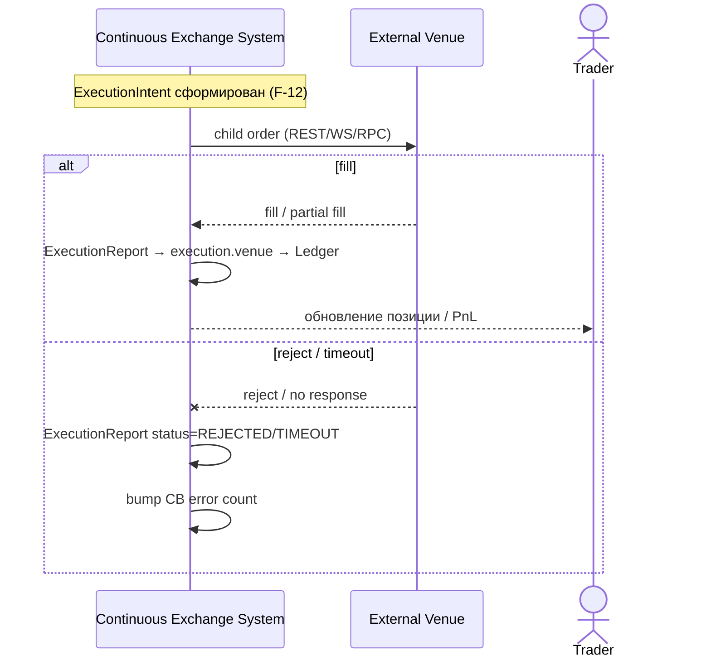

# SEQ-UC-F11-05-system. Execute hedge on venue: system view

## Type

System Context Sequence

## Feature

- [F-11](../../../features/F-11-external-venues-lob-to-fob/) (adapter)
- [F-12](../../../features/F-12-execution-hedge/) (business logic)

## Use Case

- [UC-F11-05](../use-case.md)
- Cross-link: F-12 / UC-F12-01 (auto-hedge after batch)

## Purpose

Чёрный ящик исполнения hedge-ордера: Continuous Exchange System отправляет child-orders на внешнюю площадку и получает отчёт.

## Participants

- Continuous Exchange System
- Внешняя площадка
- Trader (косвенно — через результирующий PnL/positions)

## Diagram

## Related Service Sequence

- [SEQ-F11-05-execute-on-venue-services](../../../../05-components/sequences/SEQ-F11-05-execute-on-venue-services.md)
