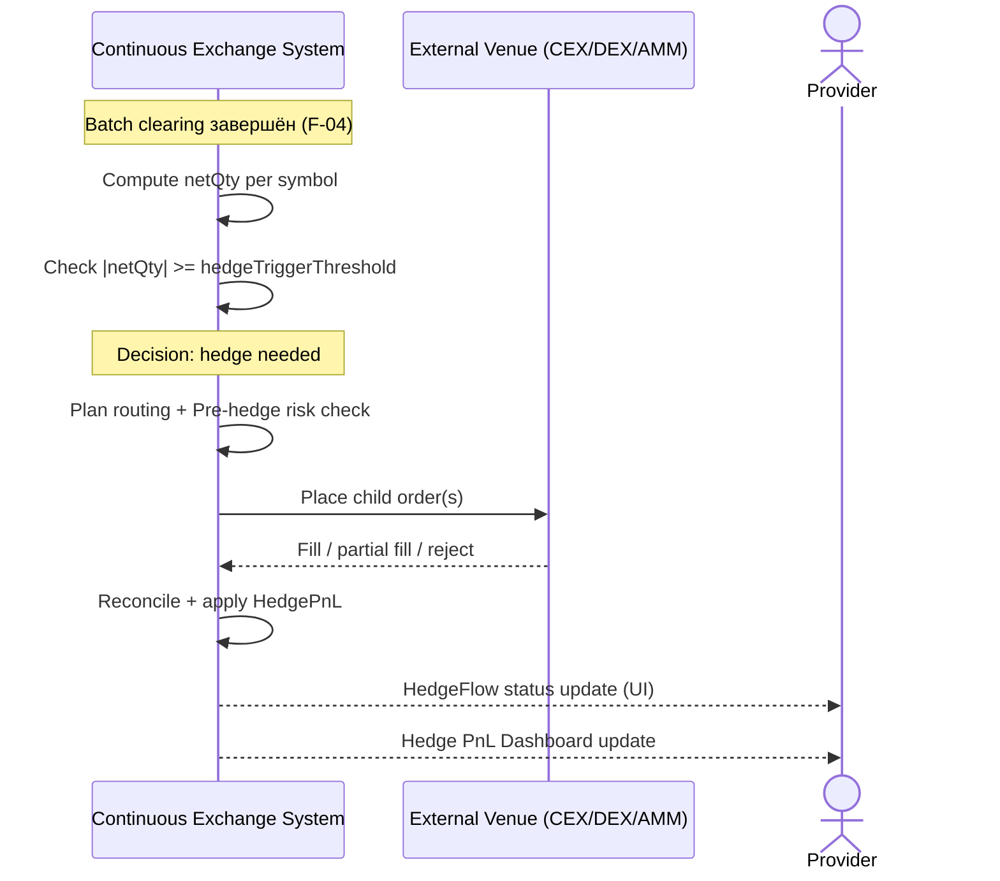

<!-- IN-013 frontmatter — Cockburn decomposition level.
---
id: SEQ-UC-F12-01-system
level: kite
---
-->

# SEQ-UC-F12-01-system. Auto Hedge After Batch: system view

## Type

System Context Sequence

## Feature

- [F-12](../../../features/F-12-execution-hedge/)

## Use Case

- [UC-F12-01](../use-case.md)

## Purpose

Auto-hedge — внутренний системный сценарий, инициируемый таймером Matching Backend после batch clearing (F-04). Внешним участникам видны только следствия: размещение child orders на venue и получение fill confirmations. Provider (биржа) — субъект, для которого хеджируется нетто-позиция.

## Participants

- Continuous Exchange System
- External Venue (CEX / DEX / AMM)
- Provider (наблюдатель — получает HedgePnL update в UI)

## Diagram

## Related Service Sequence

- [SEQ-F12-01-auto-hedge-services](../../../../05-components/sequences/SEQ-F12-01-auto-hedge-services.md)

## Source Fragments

- IN-005 §2 «Sequence diagram — основной happy path»
