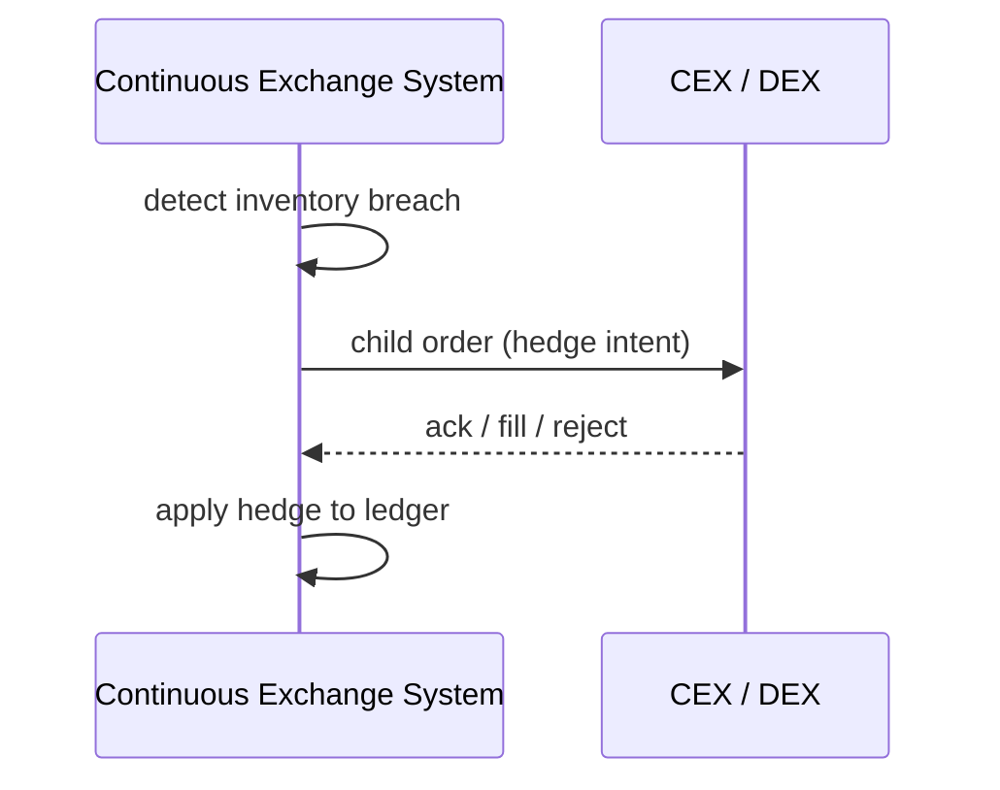

# SEQ-UC-F12-01-system. Execution Hedge: system view

## Type

System Context Sequence

## Feature

- [F-12](../../../features/F-12-execution-hedge/)

## Use Case

- [UC-F12-01](../use-case.md)

## Participants

- Continuous Exchange System
- CEX / DEX

## Diagram

## Related Service Sequence

- [SEQ-F12-UC-F12-01-services](../../../../05-components/sequences/SEQ-F12-UC-F12-01-services.md)
