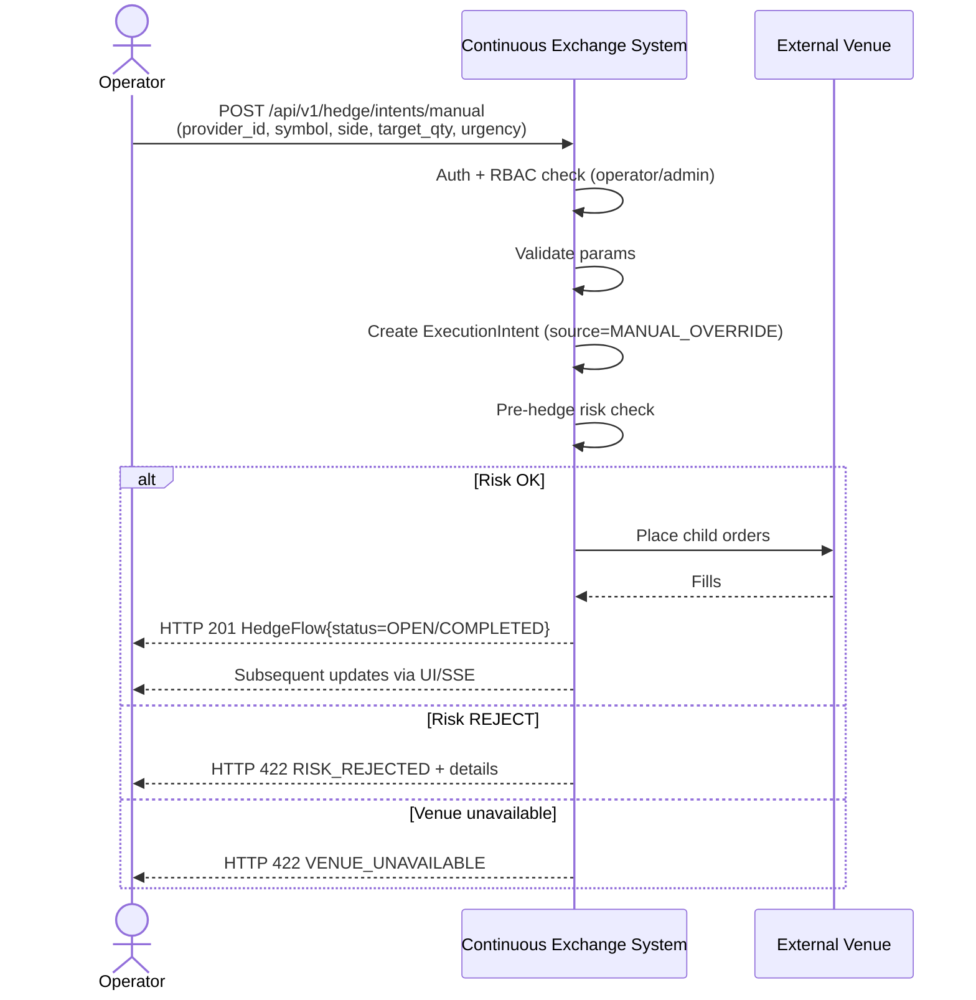

# SEQ-UC-F12-02-system. Manual Operator Hedge: system view

## Type

System Context Sequence

## Feature

- [F-12](../../../features/F-12-execution-hedge/)

## Use Case

- [UC-F12-02](../use-case.md)

## Participants

- Operator (внешний actor)
- Continuous Exchange System
- External Venue (CEX/DEX/AMM)

## Diagram

## Related Service Sequence

- [SEQ-F12-01-auto-hedge-services](../../../../05-components/sequences/SEQ-F12-01-auto-hedge-services.md) (после Gateway → одинаковая цепочка)

## Source Fragments

- IN-005 §9 «REST API»
- `contracts/openapi/fob/hedge/v1/api/hedge.yaml` operationId `createManualIntent`
