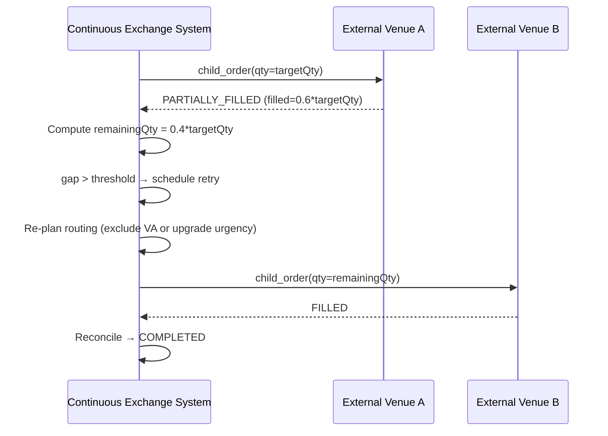

# SEQ-UC-F12-03-system. Partial Fill + Retry: system view

## Type

System Context Sequence

## Feature

- [F-12](../../../features/F-12-execution-hedge/)

## Use Case

- [UC-F12-03](../use-case.md)

## Participants

- Continuous Exchange System
- External Venue A (partial fill)
- External Venue B (retry destination)

## Diagram

## Related Service Sequence

- [SEQ-F12-01-auto-hedge-services](../../../../05-components/sequences/SEQ-F12-01-auto-hedge-services.md) (retry path)
- [SEQ-F12-03-error-scenarios-services](../../../../05-components/sequences/SEQ-F12-03-error-scenarios-services.md)

## Source Fragments

- IN-005 §5 «Reconciliation»
- IN-005 §10.1 U2 / U7
