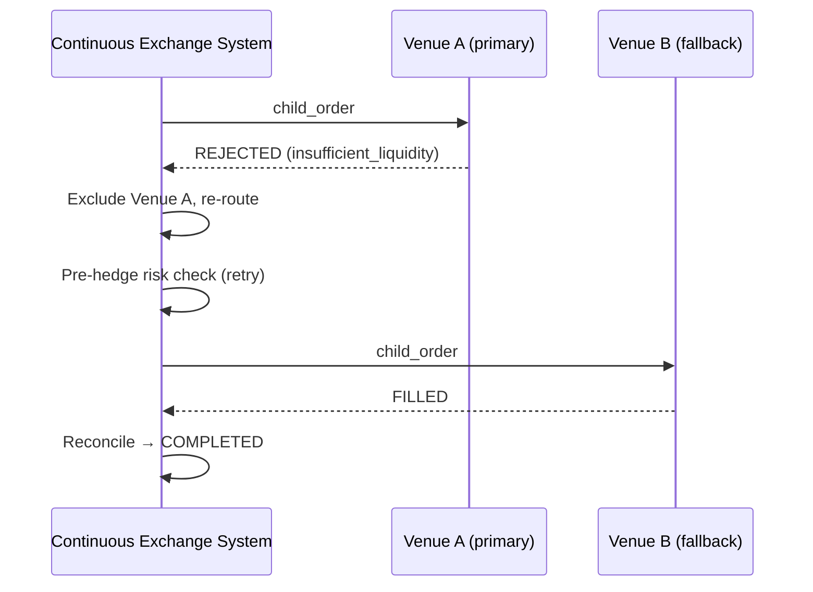

<!-- IN-013 frontmatter — Cockburn decomposition level.
---
id: SEQ-UC-F12-04-system
level: kite
---
-->

# SEQ-UC-F12-04-system. Rejection + Fallback: system view

## Type

System Context Sequence

## Feature

- [F-12](../../../features/F-12-execution-hedge/)

## Use Case

- [UC-F12-04](../use-case.md)

## Participants

- Continuous Exchange System
- External Venue A (primary, rejects)
- External Venue B (fallback, fills)

## Diagram

## Related Service Sequence

- [SEQ-F12-02-rejection-fallback-services](../../../../05-components/sequences/SEQ-F12-02-rejection-fallback-services.md)

## Source Fragments

- IN-005 §3 «Sequence diagram — rejection + fallback»
