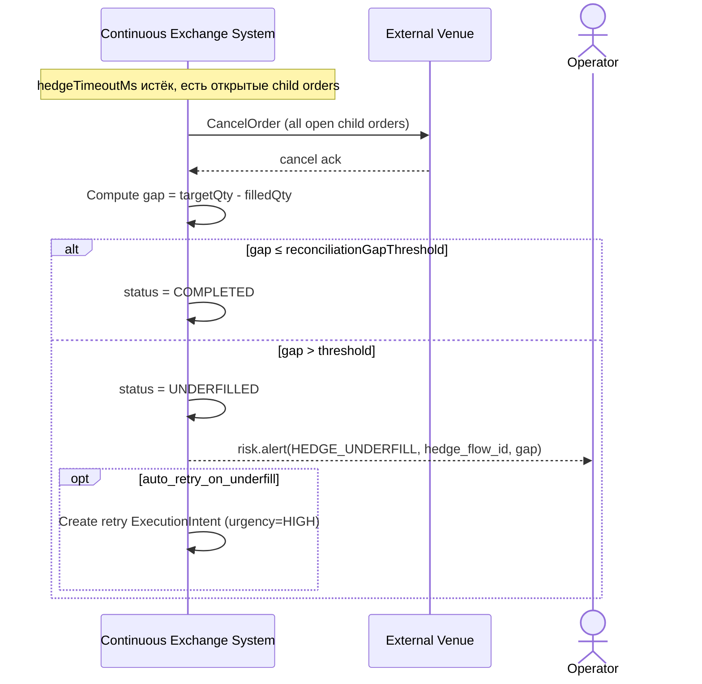

# SEQ-UC-F12-05-system. Timeout / Underfilled / Reconciliation: system view

## Type

System Context Sequence

## Feature

- [F-12](../../../features/F-12-execution-hedge/)

## Use Case

- [UC-F12-05](../use-case.md)

## Participants

- Continuous Exchange System (Adapter + Reconciliation watcher)
- External Venue (с open child orders)
- Operator (наблюдатель risk alert)

## Diagram

## Related Service Sequence

- [SEQ-F12-03-error-scenarios-services](../../../../05-components/sequences/SEQ-F12-03-error-scenarios-services.md)

## Source Fragments

- IN-005 §4 «Error scenarios»
- IN-005 §5 «Reconciliation»
