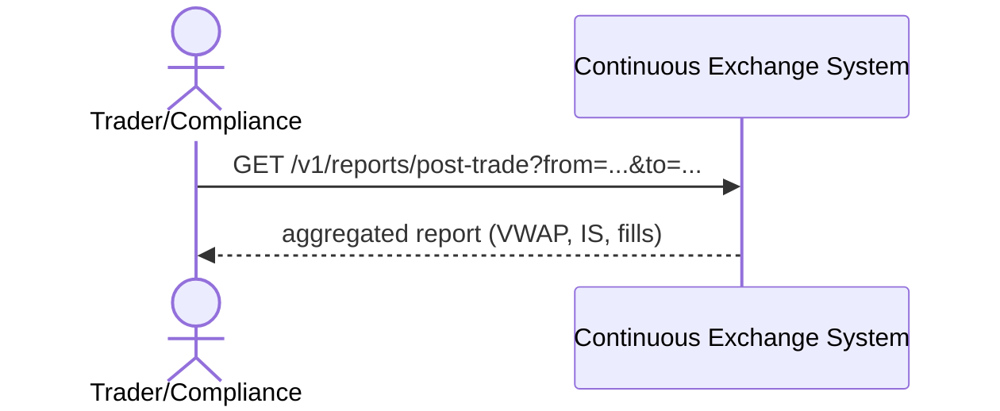

# SEQ-UC-F13-01-system. Post-Trade Report: system view

## Type

System Context Sequence

## Feature

- [F-13](../../../features/F-13-posttrade-report/)

## Use Case

- [UC-F13-01](../use-case.md)

## Participants

- Trader / Compliance
- Continuous Exchange System

## Diagram

## Related Service Sequence

- [SEQ-F13-UC-F13-01-services](../../../../05-components/sequences/SEQ-F13-UC-F13-01-services.md)
