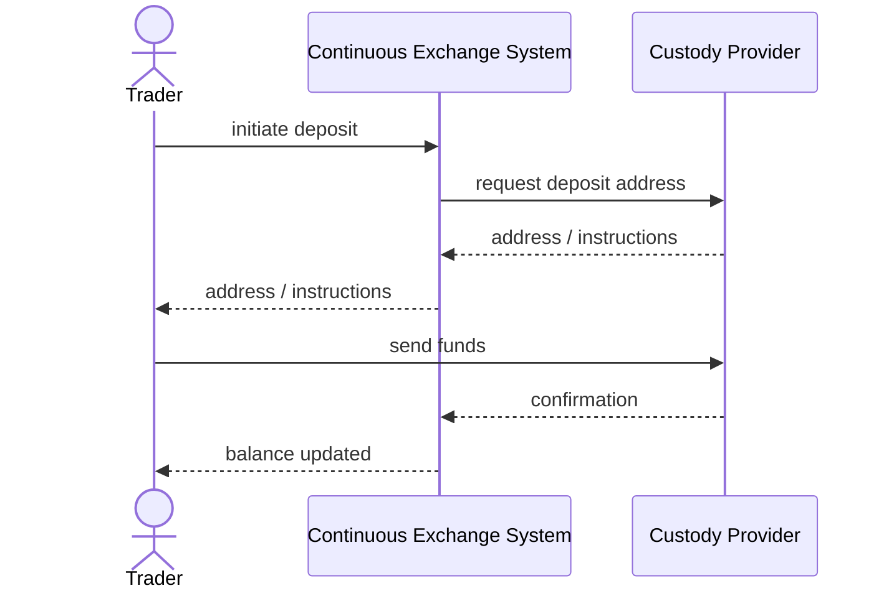

# SEQ-UC-F14-01-system. Deposit: system view

## Type

System Context Sequence

## Feature

- [F-14](../../../features/F-14-deposit-withdraw/)

## Use Case

- [UC-F14-01](../use-case.md)

## Participants

- Trader
- Continuous Exchange System
- Custody / Payment Provider

## Diagram

## Related Service Sequence

- [SEQ-F14-UC-F14-01-services](../../../../05-components/sequences/SEQ-F14-UC-F14-01-services.md)
