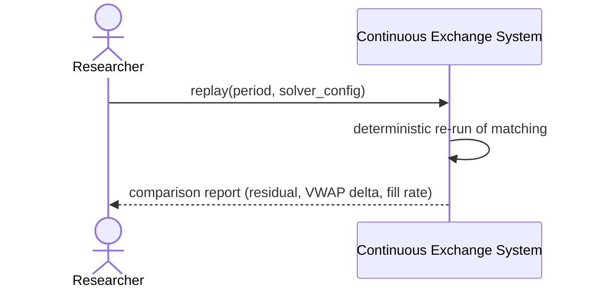

# SEQ-UC-F15-01-system. Replay: system view

## Type

System Context Sequence

## Feature

- [F-15](../../../features/F-15-backtest-replay/)

## Use Case

- [UC-F15-01](../use-case.md)

## Participants

- Researcher / Operator
- Continuous Exchange System

## Diagram

## Related Service Sequence

- [SEQ-F15-UC-F15-01-services](../../../../05-components/sequences/SEQ-F15-UC-F15-01-services.md)
