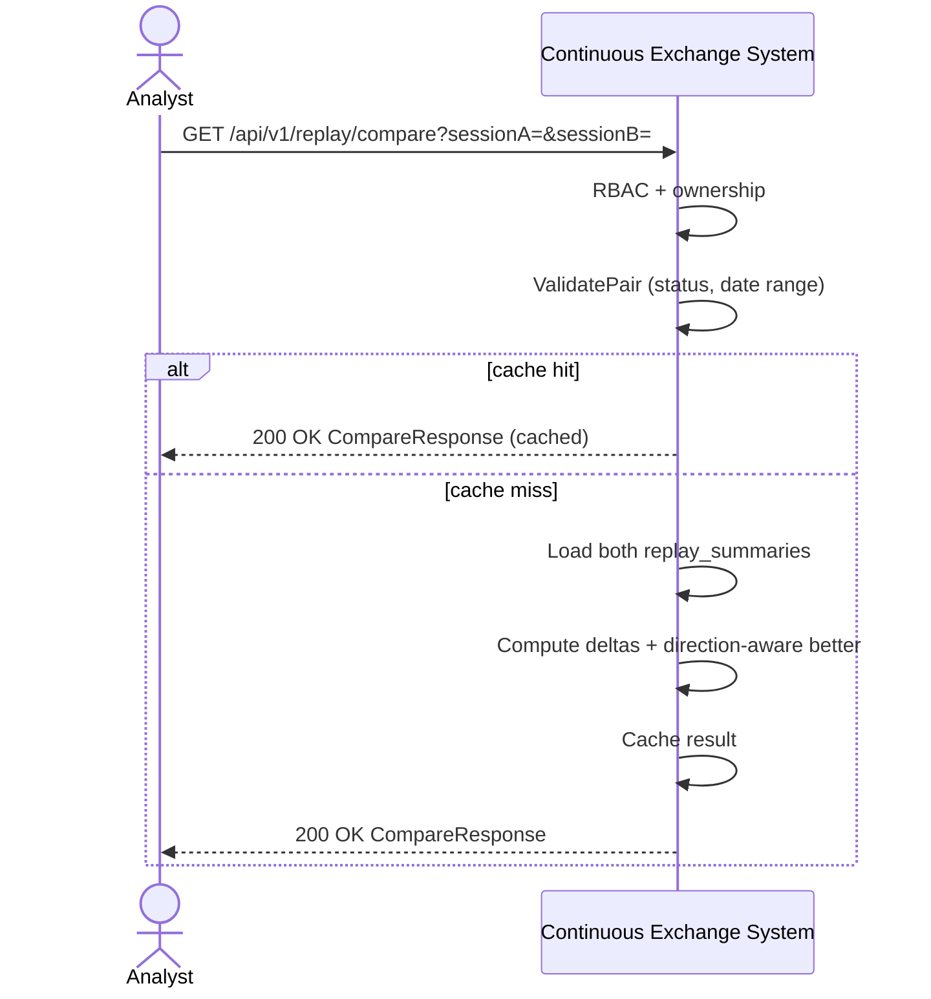

# SEQ-UC-F15-03-system. A/B Compare Sessions: system view

## Type

System Context Sequence

## Feature

- [F-15](../../../features/F-15-backtest-replay/)

## Use Case

- [UC-F15-03](../use-case.md)

## Diagram

