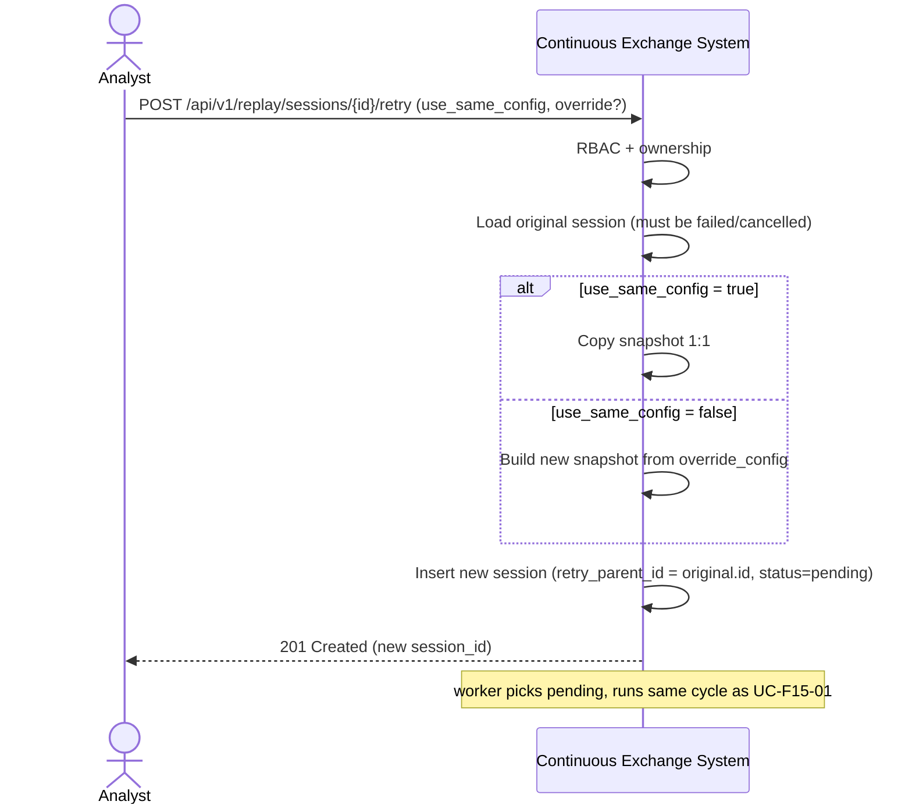

<!-- IN-013 frontmatter — Cockburn decomposition level.
---
id: SEQ-UC-F15-05-system
level: kite
---
-->

# SEQ-UC-F15-05-system. Retry Failed Session: system view

## Type

System Context Sequence

## Feature

- [F-15](../../../features/F-15-backtest-replay/)

## Use Case

- [UC-F15-05](../use-case.md)

## Diagram

