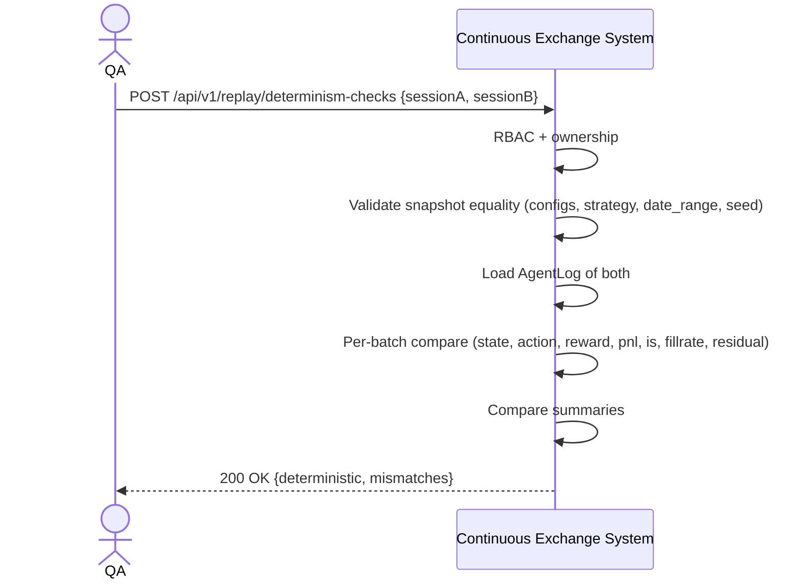

# SEQ-UC-F15-06-system. Determinism Check: system view

## Type

System Context Sequence

## Feature

- [F-15](../../../features/F-15-backtest-replay/)

## Use Case

- [UC-F15-06](../use-case.md)

## Diagram

