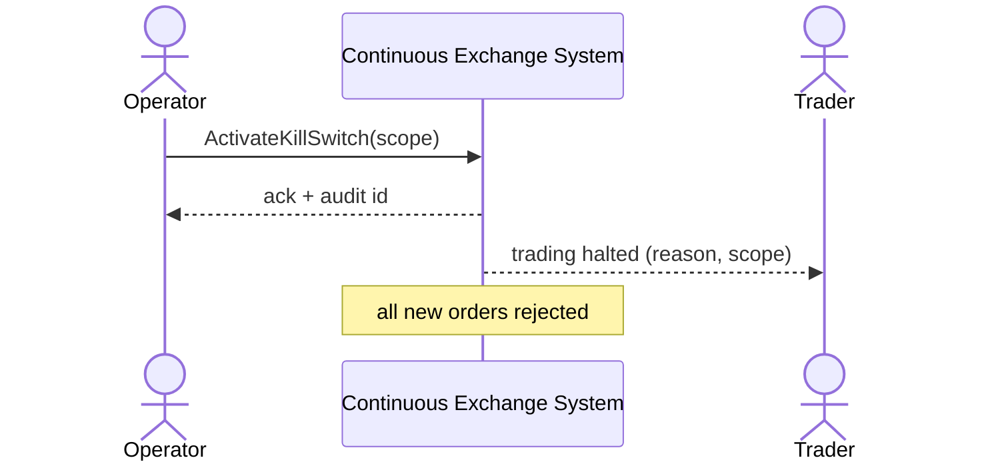

# SEQ-UC-F16-01-system. Kill-Switch: system view

## Type

System Context Sequence

## Feature

- [F-16](../../../features/F-16-operator-console/)

## Use Case

- [UC-F16-01](../use-case.md)

## Participants

- Operator
- Continuous Exchange System
- Trader (получатель уведомления)

## Diagram

## Related Service Sequence

- [SEQ-F16-UC-F16-01-services](../../../../05-components/sequences/SEQ-F16-UC-F16-01-services.md)
