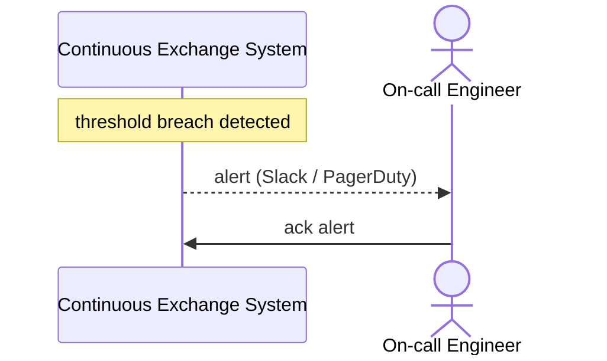

# SEQ-UC-F17-01-system. Alert: system view

## Type

System Context Sequence

## Feature

- [F-17](../../../features/F-17-monitoring-and-alerts/)

## Use Case

- [UC-F17-01](../use-case.md)

## Participants

- Continuous Exchange System
- On-call Engineer

## Diagram

## Related Service Sequence

- [SEQ-F17-UC-F17-01-services](../../../../05-components/sequences/SEQ-F17-UC-F17-01-services.md)
