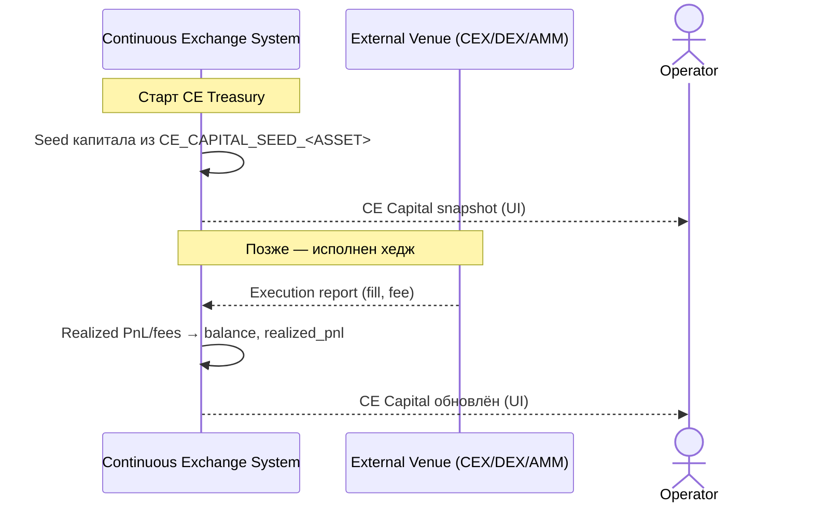

<!-- IN-013 frontmatter — Cockburn decomposition level.
---
id: SEQ-UC-F18-01-system
level: kite
---
-->

# SEQ-UC-F18-01-system. Форма капитала CE: system view

## Type

System Context Sequence

## Feature

- [F-18](../../../features/F-18-ce-capital-position-hedge/)

## Use Case

- [UC-F18-01](../use-case.md)

## Purpose

Капитал CE — внутреннее состояние системы: seed из конфигурации при старте,
пополнение realized PnL/fees от исполненных хеджей. Внешним участникам виден
только результат исполнения на площадке; Operator видит капитал в UI.

## Participants

- Continuous Exchange System
- External Venue (CEX / DEX / AMM)
- Operator (наблюдатель — видит капитал в UI)

## Diagram

## Related Service Sequence

- [SEQ-F18-UC-F18-02-services](../../../../05-components/sequences/SEQ-F18-UC-F18-02-services.md)

## Source Fragments

- ADR-054 §1, §5
