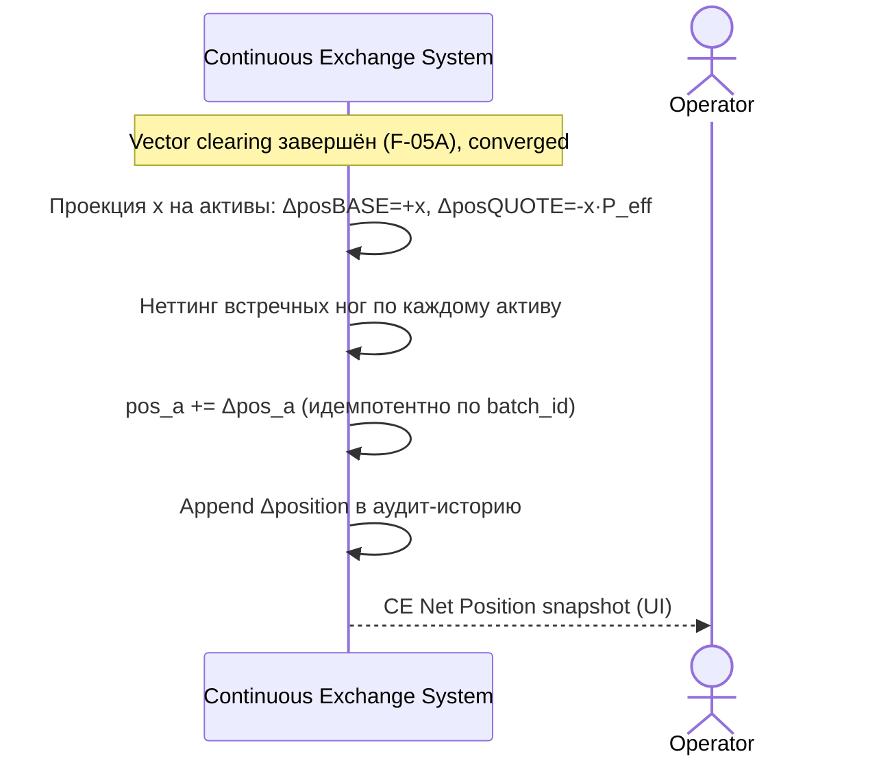

<!-- IN-013 frontmatter — Cockburn decomposition level.
---
id: SEQ-UC-F18-02-system
level: kite
---
-->

# SEQ-UC-F18-02-system. Вывод чистой позиции CE: system view

## Type

System Context Sequence

## Feature

- [F-18](../../../features/F-18-ce-capital-position-hedge/)

## Use Case

- [UC-F18-02](../use-case.md)

## Purpose

Чистая позиция CE выводится из результата клиринга (вектор x) как проекция на
активы. Полностью внутренний сценарий; внешним участникам ничего не видно —
только Operator наблюдает позицию в UI.

## Participants

- Continuous Exchange System
- Operator (наблюдатель — видит net-позицию в UI)

## Diagram

## Related Service Sequence

- [SEQ-F18-UC-F18-02-services](../../../../05-components/sequences/SEQ-F18-UC-F18-02-services.md)

## Source Fragments

- ADR-054 §2, §3
