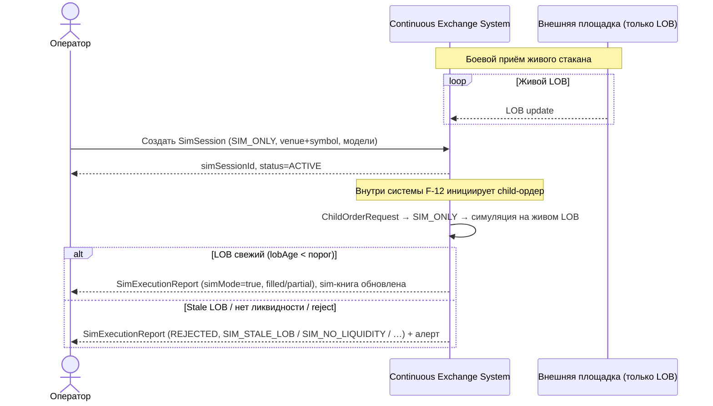

# SEQ-UC-F20-01-system — SIM_ONLY execution (system-level)

- Feature: [F-20](../../../features/F-20-live-venue-simulator/README.md)
- Use case: [UC-F20-01](../use-case.md)
- Level: L0 (внешние актёры ↔ Continuous Exchange System как чёрный ящик)

Внешняя площадка выступает только источником **живого** LOB; ордера на неё не уходят
(SIM_ONLY). Оператор задаёт sim-режим; система возвращает синтетическое исполнение.

