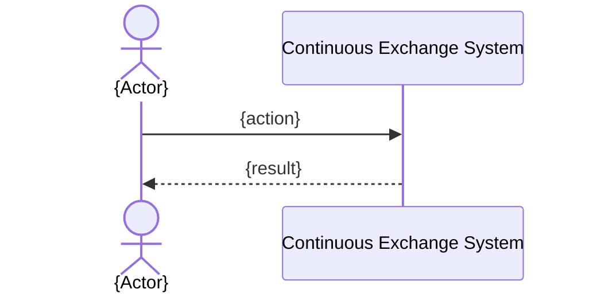

# SEQ-UC-FXX-NN-system. {Заголовок}

> **Template.** При копировании замените `{slug}`, `XX`, `NN` на конкретные значения. Пути с плейсхолдерами — шаблонные, не клики.

## Type

System Context Sequence

## Feature

- `../../../features/F-XX-{slug}/`

## Use Case

- [UC-FXX-NN](../use-case.md)

## Purpose

Показать взаимодействие внешнего участника с Continuous Exchange System как **black box** без раскрытия внутренних сервисов.

## Participants

- {Trader / Market Maker / Operator / CEX / DEX / Custody / Regulator}
- Continuous Exchange System

## Diagram

## Related Service Sequence

- `../../../../05-components/sequences/SEQ-FXX-UC-FXX-NN-services.md`

## Related Contracts

- {внешние API из docs/06-api/rest/ или WebSocket}
