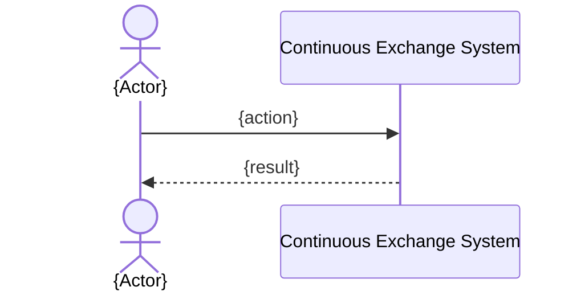

<!-- IN-013 frontmatter (YAML). Уровень декомпозиции — Cockburn `kite` ☁️ для L0 system-level sequence.
---
id: SEQ-UC-FXX-NN-system
title: "{Заголовок}"
level: kite
parent-uc: UC-FXX-NN
---
-->

# SEQ-UC-FXX-NN-system. {Заголовок}

> **Template.** При копировании замените `{slug}`, `XX`, `NN` на конкретные значения. Пути с плейсхолдерами — шаблонные, не клики.
>
> **IN-013**: `level: kite` ☁️. Участники — только внешние actors + `participant System as Continuous Exchange System`. Имена внутренних сервисов (`matching`, `risk`, ...) запрещены — для них создавайте L1 service sequence в `docs/05-components/sequences/`.

## Type

System Context Sequence (L0 ☁️)

## Feature

- `../../../features/F-XX-{slug}/`

## Use Case

- [UC-FXX-NN](../use-case.md)

## Purpose

Показать взаимодействие внешнего участника с Continuous Exchange System как **black box** без раскрытия внутренних сервисов.

## Participants

- {Trader / Market Maker / Operator / CEX / DEX / Custody / Regulator}
- Continuous Exchange System

## Diagram

```mermaid
sequenceDiagram
    actor U as {Actor}
    participant S as Continuous Exchange System

    U->>S: {action}
    S-->>U: {result}
```

## Related Service Sequence

- `../../../../05-components/sequences/SEQ-FXX-UC-FXX-NN-services.md`

## Related Contracts

- {внешние API из docs/06-api/rest/ или WebSocket}
