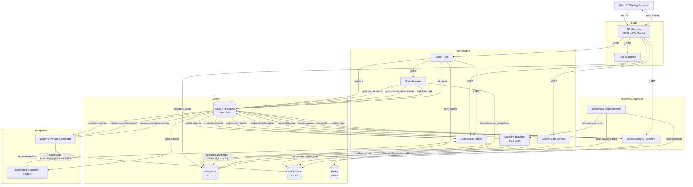

# C4 — Container Diagram (C2)

Внутренние контейнеры **Continuous Exchange System** на уровне сервисов, хранилищ и брокера.

## Diagram

## Контейнеры

| # | Container | Назначение | Технологии | Stores |
| --- | --- | --- | --- | --- |
| 1 | **Web UI / Trading Frontend** | UI: ввод заявок, графики, портфель, отчёты, операторская панель | (planned) React/TS | — |
| 2 | **API Gateway** | Edge HTTP/WebSocket → внутренний gRPC; auth, rate-limit, маршрутизация | C++20 (Crow + gRPC) | — |
| 3 | **Auth & Identity** | Регистрация, логин, сессии, роли, KYC-status | (planned) C++/Go | PostgreSQL (users, sessions) |
| 4 | **Order Flow** | Lifecycle FlowOrder: pre-trade, reserve, publish | C++20 + gRPC + Kafka | — |
| 5 | **Matching Backend (FOB Core)** | Solver равновесной цены/скорости, формирование `BatchResult` | C++20 | Kafka in/out, PG (solver_config) |
| 6 | **Risk Manager** | Pre/post-trade risk, kill-switch | C++20 + gRPC + Kafka | PG (risk_limits, risk_snapshots) |
| 7 | **Collateral & Ledger** | Балансы, резервы, применение fills | C++20 + gRPC + Kafka | PG (accounts, positions, collateral_transfers) |
| 8 | **Market Data Service** | Кэш тикеров, streaming UI/клиентам | C++20 + Kafka | Redis (ticker cache), ClickHouse (history) |
| 9 | **External Venues Connector** | Адаптеры CEX/DEX/AMM, `marketdata.raw`, hedge | C++20 (planned) | — |
| 10 | **Backtest & Replay Engine** | Воспроизведение истории, сравнение политик | (planned) Python/C++ | ClickHouse (read) |
| 11 | **Observability & Reporting** | Метрики, логи, отчёты, регуляторные выгрузки | C++20 | ClickHouse (write) |
| 12 | **Message Broker (Kafka/Redpanda)** | Шина событий | Redpanda 23.x | — |
| 13 | **Blockchain / Custody Adapter** | On-chain deposits / withdrawals, custody sync | (planned) | — |

## Хранилища

| Store | Тип | Назначение | Источник истины |
| --- | --- | --- | --- |
| **PostgreSQL** | OLTP | Пользователи, заявки, балансы, лимиты, snapshots | yes |
| **ClickHouse** | OLAP | Fills, batch_results, marketdata, risk_events, agent_logs, execution_reports | yes (для аналитики/replay) |
| **Redis** | cache | Last tickers, sessions (опц.) | no (derivable) |
| **Kafka / Redpanda** | event bus | orders.normalized, batch.outputs, risk.alerts, marketdata.raw, execution.intents, execution.reports | yes (audit / replay) |

Подробности хранилищ — в [`../07-data/`](../07-data/).

## Потоки данных (ключевые)

| Поток | Direction | Channel | Документ |
| --- | --- | --- | --- |
| CreateFlowOrder | UI → GW → OF | REST → gRPC | [SEQ-F02-UC-F02-01-services](../05-components/sequences/SEQ-F02-UC-F02-01-services.md) |
| BatchClearing | внутренний таймер | Kafka | [SEQ-F04-UC-F04-01-services](../05-components/sequences/SEQ-F04-UC-F04-01-services.md) |
| Live MD | EV → Kafka → MD → UI | Kafka + WS | [SEQ-F05-UC-F05-01-services](../05-components/sequences/SEQ-F05-UC-F05-01-services.md) |
| Pre-trade risk | OF → RISK | gRPC | [SEQ-F07-UC-F07-01-services](../05-components/sequences/SEQ-F07-UC-F07-01-services.md) |
| Execution hedge | SRC → EV → CEX | Kafka + venue SDK | [SEQ-F12-UC-F12-01-services](../05-components/sequences/SEQ-F12-UC-F12-01-services.md) |

## Связанные документы

- [context-diagram.md](context-diagram.md) — выше уровнем (C1).
- [components-overview.md](../05-components/components-overview.md) — текстовое описание каждого компонента.
- [communication.md](communication.md) — event-driven правила.
- Per-topic: [`../06-api/messaging/topics.md`](../06-api/messaging/topics.md).
- Data: [`../07-data/data-overview.md`](../07-data/data-overview.md).

## Source Fragments

- IN-001-FR-024
