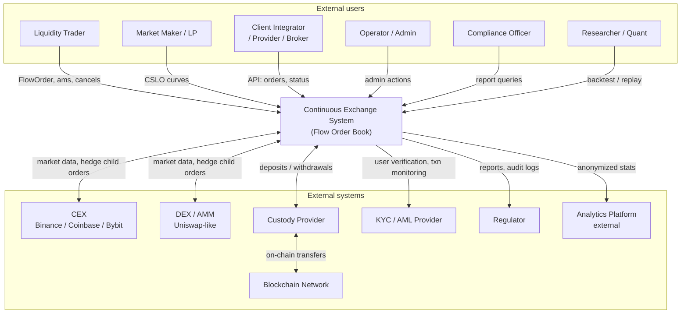

# C4 — Context Diagram (C1)

Внешние участники и внешние системы, взаимодействующие с **Continuous Exchange System** (CES).

## Diagram

## Описание

CES — единое целое с точки зрения внешнего наблюдателя. Внутренние компоненты раскрыты на уровне C2 — см. [container-diagram.md](container-diagram.md).

### Внешние пользователи

| Actor | Поток в CES | Поток из CES |
| --- | --- | --- |
| **Liquidity Trader** | заявки `FlowOrder` (single / portfolio) | preview VWAP/IS, fills, статусы, отчёты, balances |
| **Market Maker / LP** | CSLO-кривые (P_L, P_H, Q, U, slope), inventory caps | fills по кривой, PnL, inventory exposure, adverse selection |
| **Client Integrator** | заявки от множества клиентов (агрегатор) | агрегированные fills, отчёты, лимиты |
| **Operator / Admin** | конфигурация (risk_limits, solver_config, fees), kill-switch | dashboards, alerts, audit |
| **Compliance Officer** | запросы регуляторных выгрузок | trade logs, decisions, risk events |
| **Researcher** | backtest / replay scenarios | сравнение результатов |

### Внешние системы

| External system | Назначение | Bidirectional? |
| --- | --- | --- |
| **CEX** (Binance, Coinbase и т.д.) | reference prices, execution hedge target | yes |
| **DEX / AMM** (Uniswap, Curve) | on-chain liquidity «of last resort» | yes |
| **Custody Provider** | хранение активов, деньги клиентов | yes |
| **Blockchain** | settlement layer для on-chain ops | yes |
| **KYC / AML Provider** | верификация и мониторинг | mostly outbound |
| **Regulator** | получатель отчётности | outbound |
| **Analytics Platform** | публичная статистика | outbound |

## Что НЕ показано на C1

Этот уровень намеренно скрывает:

- API Gateway, Auth, Matching, Risk, Ledger и прочие внутренние сервисы;
- Kafka, PostgreSQL, ClickHouse, Redis;
- внутреннюю реализацию hedge / клиринга / лимитов.

Эти артефакты находятся на уровне C2 в [container-diagram.md](container-diagram.md), а пошаговое поведение — в use-case-/service-level sequence diagrams (см. [`../02-system/use-cases/`](../02-system/use-cases/), [`../05-components/sequences/`](../05-components/sequences/)).

## Связанные документы

- [actors.md](../02-system/actors.md) — детально по каждому actor.
- [container-diagram.md](container-diagram.md) — следующий уровень детализации.
- [architecture-overview.md](architecture-overview.md) — обзор архитектуры.

## Source Fragments

- IN-001-FR-021
