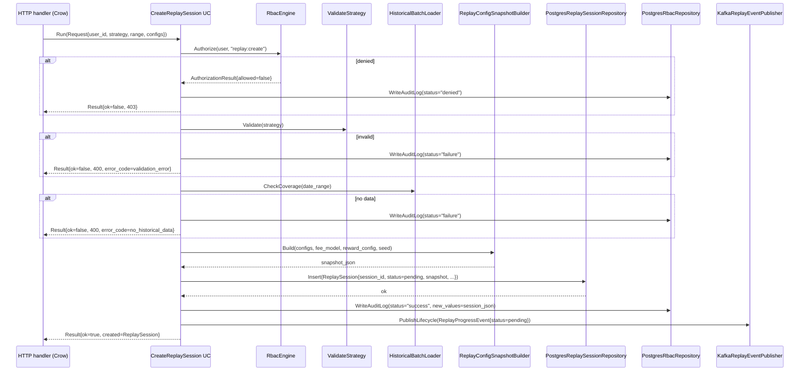

<!-- IN-013 frontmatter — Cockburn decomposition level.
---
id: SEQ-BACKTEST-01-create-session
level: fish
component: backtest-service
---
-->

# SEQ-BACKTEST-01. Internal: CreateReplaySession

## Type

Internal Component Sequence (внутри `cpp/backtest`)

## Feature

- [F-15](../../../02-system/features/F-15-backtest-replay/)

## Use Case

- [UC-F15-01](../../../02-system/use-cases/UC-F15-01-create-replay-session/use-case.md)

## Purpose

Внутренняя последовательность вызовов в `cpp/backtest` при обработке
`CreateReplaySessionUC`. Service-level контекст — в
[SEQ-F15-01-create-session-services](../../sequences/SEQ-F15-01-create-session-services.md).

## Diagram

