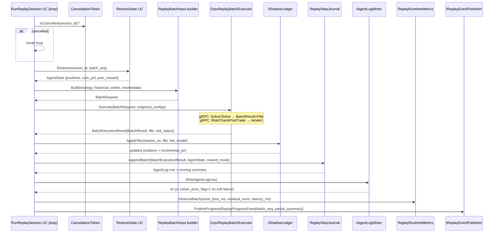

<!-- IN-013 frontmatter — Cockburn decomposition level.
---
id: SEQ-BACKTEST-02-batch-replay-step
level: fish
component: backtest-service
---
-->

# SEQ-BACKTEST-02. Internal: Per-batch replay step

## Type

Internal Component Sequence (один шаг внутри `RunReplaySessionUC::Run` loop)

## Feature

- [F-15](../../../02-system/features/F-15-backtest-replay/)

## Purpose

Детализирует, что происходит внутри одной итерации основного replay-цикла
(`for batch_seq in 1..N`). Service-level — см.
[SEQ-F15-02-replay-cycle-services](../../sequences/SEQ-F15-02-replay-cycle-services.md).

## Diagram

## Failure handling (inside one iteration)

- **Solver error / residual_norm > tolerance** → AgentLog с
  `solver_error_flag=1`, `failure_component="matching"`, `error_code`.
  Loop **продолжается** (soft failure).
- **Risk reject** → `risk_status="rejected"`, fills не применяются, AgentLog
  с `failure_component="risk"`. Soft failure.
- **Ledger error** → `failure_component="ledger"`, soft failure.
- **ClickHouse INSERT failure** → retry с exponential backoff; при
  превышении retry budget — soft failure, продолжаем (loss tolerable).
- **PostgreSQL session update failure** → hard failure, loop aborted, status
  = `failed`.
