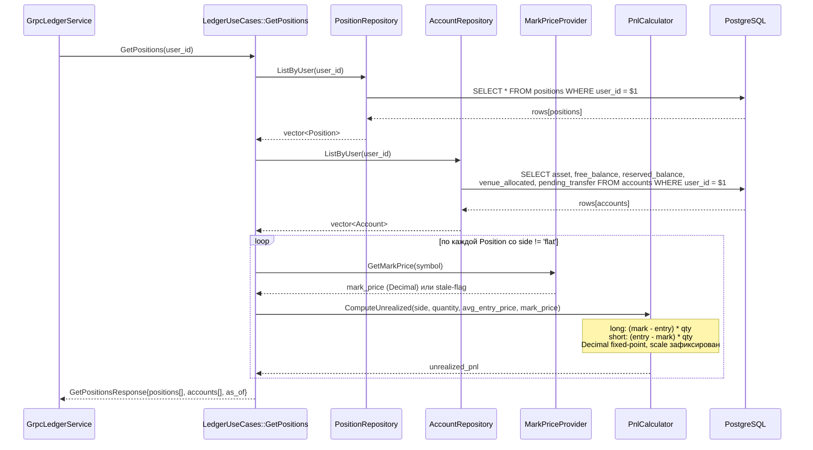

<!-- IN-013 frontmatter — Cockburn decomposition level.
---
id: SEQ-LEDGER-001-get-positions
level: fish
component: ledger
---
-->

# SEQ-LEDGER-001. Internal: GetPositions (build positions + unrealized PnL)

## Type

Internal Component Sequence (внутри `LedgerUseCases::GetPositions`)

## Feature

- [F-06](../../../02-system/features/F-06-positions-pnl-margin/)

## Use Case

- [UC-F06-01](../../../02-system/use-cases/UC-F06-01-show-positions/use-case.md)

## Purpose

Детализирует, что происходит внутри одного вызова `GetPositions(user_id)`:
как читаются строки `positions` и `accounts` из PostgreSQL, как для каждой
открытой позиции пересчитывается `unrealized_pnl` относительно текущей mark
price, и как собирается gRPC-ответ.

Service-level (cross-component) — см.
[SEQ-F06-UC-F06-01-services](../../sequences/SEQ-F06-UC-F06-01-services.md).

## Diagram

## Internal failure handling

- **Нет строк в `positions`** → возврат пустого списка позиций (не ошибка);
  балансы из `accounts` всё равно возвращаются.
- **Mark price отсутствует / устарел** (`MarkPriceProvider` вернул stale-flag)
  → `unrealized_pnl` берётся из последнего сохранённого `positions.unrealized_pnl`,
  ответ помечается `mark_stale=true`, пишется WARN-лог. PnL не обнуляется молча.
- **`side = 'flat'` или `quantity = 0`** → `unrealized_pnl = 0`, mark price не
  запрашивается.
- **Ошибка чтения PostgreSQL** → typed `Error{code, message}`, частичный ответ
  не отдаётся.

## Decimal / precision notes (CLAUDE.md §9)

- Все денежные величины — `Decimal` (fixed-point), `double` запрещён.
- `ComputeUnrealized` явно фиксирует scale результата и не смешивает base/quote
  amount с price; покрывается unit-тестами U1–U3 (см.
  [F-06 tasks](../../../implementation-plan/F-06-positions-pnl-margin.tasks.md)).

## Related Contracts

- [`fob.ledger.v1.LedgerService/GetPositions`](../../../06-api/grpc/ledger-get-positions.md)
- [`fob.ledger.v1.LedgerService/GetBalances`](../../../06-api/grpc/ledger-get-balances.md)

## Related Data Objects

- [`positions`](../../../07-data/oltp-schema.md#таблица-positions)
- [`accounts`](../../../07-data/oltp-schema.md#таблица-accounts)

## Related Components

- [ledger](../overview.md)
- [market-data](../../market-data/overview.md) — источник mark price (external)
