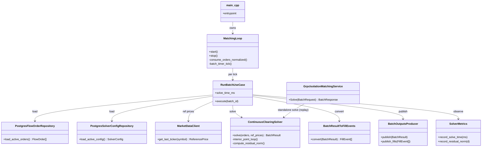

# Компонент: matching (matching-fob-core)

Сервис непрерывного клиринга. Читает `orders.normalized` из Kafka, поддерживает реестр активных ордеров, периодически запускает solver и публикует `BatchResult` в `batch.outputs`.

## 🧭 Navigation (IN-013)

| ⬆️ Куда / зачем | Ссылка |
| --- | --- |
| Какие features используют этот компонент? | F-04 (Batch Clearing), F-09 (Combo Orders, grouped solver), F-12 (Hedge Triggers, planner) |
| L0 system-boundary view | [F-04 README → L0](../../02-system/features/F-04-batch-clearing/) |
| L1 service-level view | [SEQ-F04-UC-F04-01-services](../sequences/SEQ-F04-UC-F04-01-services.md) |
| L2 component-internal view | секция «L2 sequences (Fish 🐟)» ниже |

## 🏗 Class structure (внутреннее устройство, L2 🐟)

Высокоуровневая структура сервиса (соответствует слоям из CLAUDE.md §10):

Полное соответствие классов → cpp/-файлов — в секции «💻 Код» ниже.

## 🐟 L2 sequences (component-internal)

Эти sequences показывают, как UC F-04 / F-09 / F-12 реализуются через
внутренние классы `matching`.

| L2 sequence | Запускается из | Использует классы |
| --- | --- | --- |
| [SEQ-MATCHING-001-solver-cycle](sequences/SEQ-MATCHING-001-solver-cycle.md) | [UC-F04-01](../../02-system/use-cases/UC-F04-01-run-batch-clearing/use-case.md) step 1–4 | MatchingLoop, RunBatchUseCase, ContinuousClearingSolver, BatchResultToFillEvents, BatchOutputsProducer, SolverMetrics, PostgresFlowOrderRepository, MarketDataClient |
| (TBD) SEQ-MATCHING-002-grouped-solve | [UC-F09-02](../../02-system/use-cases/UC-F09-02-grouped-matching/use-case.md) | GroupedSolverBisection, MultilegFeasibleCaps, ConstraintEvaluator |
| (TBD) SEQ-MATCHING-003-hedge-trigger | [UC-F12-01](../../02-system/use-cases/UC-F12-01-auto-hedge-after-batch/use-case.md) | HedgeTriggerPolicy, ExecutionPlanner, ExecutionIntentBuilder |

## 💻 Код (соответствие класс ↔ файл)

| Класс / модуль | Файл |
| --- | --- |
| entry point | [src/main.cpp](../../../cpp/matching/src/main.cpp) |
| MatchingLoop (consumer + batch timer) | [src/app/matching_loop.cpp](../../../cpp/matching/src/app/matching_loop.cpp) |
| RunBatchUseCase | [src/app/run_batch_uc.cpp](../../../cpp/matching/src/app/run_batch_uc.cpp) |
| ContinuousClearingSolver | [src/domain/solver_impl.cpp](../../../cpp/matching/src/domain/solver_impl.cpp) (math foundation — [IN-012 / ADR-035](../../09-implementation/solver-foundation.md)) |
| BatchResultToFillEvents | [src/domain/batch_result_to_fill_events.cpp](../../../cpp/matching/src/domain/batch_result_to_fill_events.cpp) |
| GroupedSolverBisection (F-09) | [src/domain/grouped_solver_bisection.cpp](../../../cpp/matching/src/domain/grouped_solver_bisection.cpp) |
| MultilegFeasibleCaps (F-09) | [src/domain/multileg_feasible_caps.cpp](../../../cpp/matching/src/domain/multileg_feasible_caps.cpp) |
| ConstraintEvaluator (F-09) | [src/domain/constraint_evaluator.cpp](../../../cpp/matching/src/domain/constraint_evaluator.cpp) |
| HedgeTriggerPolicy (F-12) | [src/app/hedge_trigger_policy.cpp](../../../cpp/matching/src/app/hedge_trigger_policy.cpp) |
| ExecutionPlanner (F-12) | [src/app/execution_planner.cpp](../../../cpp/matching/src/app/execution_planner.cpp) |
| ExecutionIntentBuilder (F-12) | [src/app/execution_intent_builder.cpp](../../../cpp/matching/src/app/execution_intent_builder.cpp) |
| PostgresFlowOrderRepository | [src/infra/postgres/postgres_flow_order_repository.cpp](../../../cpp/matching/src/infra/postgres/postgres_flow_order_repository.cpp) |
| PostgresSolverConfigRepository | [src/infra/postgres/postgres_solver_config_repository.cpp](../../../cpp/matching/src/infra/postgres/postgres_solver_config_repository.cpp) |
| MarketDataClient (gRPC) | [src/infra/market_data/market_data_client.cpp](../../../cpp/matching/src/infra/market_data/market_data_client.cpp) |
| BatchOutputsProducer (Kafka) | [src/infra/kafka/batch_outputs_producer.cpp](../../../cpp/matching/src/infra/kafka/batch_outputs_producer.cpp) |
| GrpcIsolationMatchingService | [src/transport/grpc_isolation_matching_service.cpp](../../../cpp/matching/src/transport/grpc_isolation_matching_service.cpp) |
| SolverMetrics | [src/app/solver_metrics.cpp](../../../cpp/matching/src/app/solver_metrics.cpp) |

## Старая «Код» (legacy секция)

- [cpp/matching/](../../../cpp/matching/) — каталог
- [src/main.cpp](../../../cpp/matching/src/main.cpp) — entrypoint
- [src/app/matching_loop.cpp](../../../cpp/matching/src/app/matching_loop.cpp) — два потока: consumer + batch timer
- [src/domain/solver.hpp](../../../cpp/matching/src/domain/solver.hpp) — placeholder интерфейс для будущего LP/QP solver

## Конфигурация

| env | Default | Назначение |
|---|---|---|
| `KAFKA_BROKERS` | redpanda:9092 | Kafka |
| `BATCH_INTERVAL_MS` | 1000 | Период работы солвера |

## Текущая реализация (MVP-симулятор, НЕ настоящий solver)

[matching_loop.cpp:148-203](../../../cpp/matching/src/app/matching_loop.cpp#L148-L203) — для каждого ордера независимо:
- `dq = min(remaining_qty, max_speed * batch_interval_ms)`
- `price = midpoint(price_low, price_high)`
- `notional = dq * price`

Затем по символу считается среднее midpoint'ов и публикуется как `clear_prices`.

> **Это не F-04 в полном смысле.** F-04 предписывает единую клиринговую цену на инструмент через решение системы `D(p) = 0`. Гэпы перечислены в [features/F-04-batch-clearing/](../../02-system/features/F-04-batch-clearing/).

## Связанные фичи

- F-04 (Batch Clearing Cycle) — основная фича
- F-09 (Batch and Combo Orders) — multi-leg, не реализовано
- F-11 (External Venues LOB → FOB) — не реализовано
- F-12 (Execution Hedge) — не реализовано

## Известные несоответствия F-04

1. **Источник входа: Kafka, а не PostgreSQL `floworders`.**
2. **Нет вызова Market Data Service** за reference prices.
3. **Цена fill — per-order midpoint**, не единая клиринговая.
4. **`residualNorm = 0.0` и `solveTimeMs = 1` захардкожены.**
5. **`executed_rates` показывает `max_speed`**, а не фактическую скорость.
6. **Нет fallback при non-convergence, нет kill-switch при SLA breach.**
7. **Нет multi-leg / portfolio orders.**
8. **Нет полей `liquidity_source`, `fees`, `fill_id` в Fill.**
9. **Один Kafka топик `batch.outputs` вместо двух (нет `fills`).**

Полный анализ — в [F-04-batch-clearing/](../../02-system/features/F-04-batch-clearing/).

## Participates In Features

- [F-02](../../02-system/features/F-02-create-floworder/), [F-03](../../02-system/features/F-03-order-lifecycle/), [F-04](../../02-system/features/F-04-batch-clearing/), [F-08](../../02-system/features/F-08-posttrade-risk-and-liquidations/), [F-09](../../02-system/features/F-09-batch-combo-orders/), [F-10](../../02-system/features/F-10-mm-curves/), [F-11](../../02-system/features/F-11-external-venues-lob-to-fob/), [F-12](../../02-system/features/F-12-execution-hedge/), [F-15](../../02-system/features/F-15-backtest-replay/), [F-16](../../02-system/features/F-16-operator-console/)

## Participates In Use Cases

- [UC-F02-01](../../02-system/use-cases/UC-F02-01-create-flow-order/use-case.md), [UC-F03-01](../../02-system/use-cases/UC-F03-01-amend-cancel-order/use-case.md), [UC-F04-01](../../02-system/use-cases/UC-F04-01-run-batch-clearing/use-case.md), [UC-F08-01](../../02-system/use-cases/UC-F08-01-liquidate-position/use-case.md), [UC-F09-01](../../02-system/use-cases/UC-F09-01-create-combo-order/use-case.md), [UC-F10-01](../../02-system/use-cases/UC-F10-01-publish-mm-curve/use-case.md), [UC-F11-01](../../02-system/use-cases/UC-F11-01-ingest-external-marketdata/use-case.md), [UC-F12-01](../../02-system/use-cases/UC-F12-01-auto-hedge-after-batch/use-case.md), [UC-F15-01](../../02-system/use-cases/UC-F15-01-replay-historical-batch/use-case.md), [UC-F16-01](../../02-system/use-cases/UC-F16-01-trigger-kill-switch/use-case.md)

## Participates In Sequence Diagrams

- [SEQ-F03-UC-F03-01-services](../sequences/SEQ-F03-UC-F03-01-services.md), [SEQ-F04-UC-F04-01-services](../sequences/SEQ-F04-UC-F04-01-services.md), [SEQ-F08-UC-F08-01-services](../sequences/SEQ-F08-UC-F08-01-services.md), [SEQ-F09-UC-F09-01-services](../sequences/SEQ-F09-UC-F09-01-services.md), [SEQ-F10-UC-F10-01-services](../sequences/SEQ-F10-UC-F10-01-services.md), [SEQ-F11-UC-F11-01-services](../sequences/SEQ-F11-UC-F11-01-services.md), [SEQ-F12-01-auto-hedge-services](../sequences/SEQ-F12-01-auto-hedge-services.md), [SEQ-F15-UC-F15-01-services](../sequences/SEQ-F15-UC-F15-01-services.md), [SEQ-F16-UC-F16-01-services](../sequences/SEQ-F16-UC-F16-01-services.md)

## Owned Contracts

- `fob.matching.v1.BatchResult`, `Fill`, `OrderUpdate`, `BatchDiagnostics` — [../../06-api/grpc/](../../06-api/grpc/)

## Produced Events

- [batch.outputs](../../06-api/messaging/batch-outputs.md)
- (planned) [execution.intents](../../06-api/messaging/execution-intents.md)

## Consumed Events

- [orders.normalized](../../06-api/messaging/orders-normalized.md)

## Data Access

- (planned) `solver_config`, `flow_orders` (snapshot) — [../../07-data/data-overview.md](../../07-data/data-overview.md)
- (planned) `fills`, `batch_results` (write to ClickHouse via observability)
